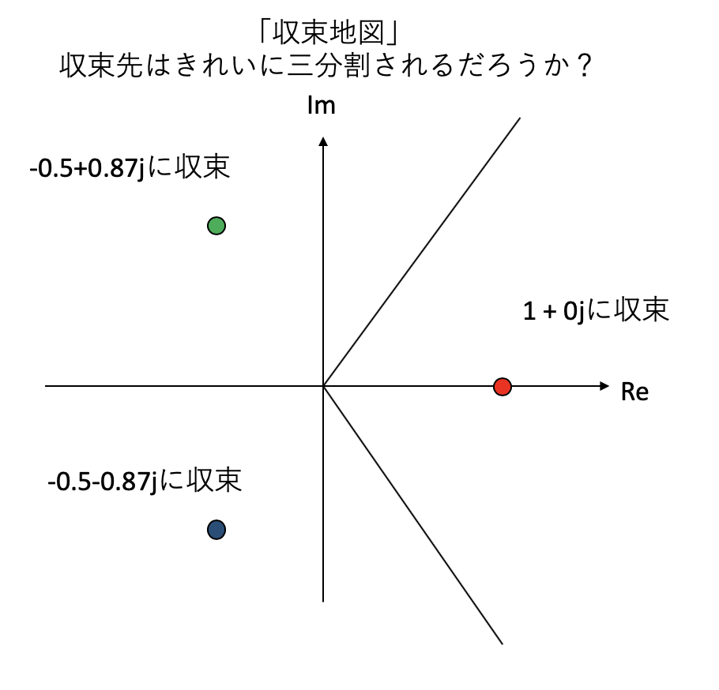

# [条件分岐と繰り返し処理1](https://kaityo256.github.io/python_zero/basic/)

## 本講で学ぶこと

* 組み込み型
* 関数の宣言と利用方法
* for文による繰り返し処理
* if文による条件分岐
* ニュートン法

## 組み込み型

Pythonに限らず、プログラム言語には「型 (type)」がある。「型」とは、そのデータが何を表現しているかを表すものである。
「型」は自分で作ることもできるが、言語にもともと備わっている型もあり、それを「組み込み型 (Built-in types)」と呼ぶ。

### 真偽値

「真(True)」であるか「偽(False)」であるかの二値だけを取る型で、条件分岐などで使われる。セルに`True`と入力して実行せよ。`True`と表示されるはずである。これは`True`を評価したら`True`になった、という意味だ(これは全く当たり前のことではない。「評価」については後ほど触れる)。`False`を評価すると`False`になる。なお、`#`以降はコメントであり、入力の必要はない。また、`# =>`とは、慣習として「その行を実行するとこの結果が出てくるよ」という意味である。例えば一行目の`True # => True`は、`True`とだけ入力して実行すると、結果が`True`と帰ってくるという意味である。

```py
True # => True
False # => False
```

上記は二行まとめて書いているが、実際にはどちらか一行を書いて実行すると、その右にある結果が表示される、という意味である。

また、`not`をつけると真偽値が逆転する。

```py
not True # => False
not False # => True
```

二つの真偽値を使って論理演算もできる。`and`は「かつ」、`or`は「または」を意味する。
「真かつ偽」は「偽」だし、「真または偽」は「真」である。

```py
True and False # => False
True or False # => True
not True # => False
not False # => True
```

### 整数

「1」「2」「3」といった整数を表現する。四則演算や比較などができる。負の数も扱える。

```py
1 # => 1
1 + 2 # => 3
2 * 6 # => 12
2 - 5 # => -3
```

整数同士を比較すると真偽値になる。条件分岐や、ループの終了条件等に用いる。

```py
1 == 1 #=> True
1 == 2 #=> False
1 != 1 #=> False
1 != 2 #=> True
1 < 2  #=> True
1 > 2  #=> False
```

### 浮動少数点

「0.1」「123.45」といった、整数ではない値を表現する。整数と同様に四則演算や比較ができるし、負の数も扱える。

```py
0.5 + 0.5 #=> 1.0
0.5 * 0.5 #=> 0.25
0.5 < 1.0 #=> True
```

ただし、浮動小数点数は内部的には **その数値に最も近い近似値** を扱っているため、誤差が存在する。例えば0.1を3回足しても0.3にならない。

```py
0.1 + 0.1 + 0.1 #=> 0.30000000000000004
0.1 + 0.1 == 0.2 # => True
0.1 + 0.1 + 0.1 == 0.3 #=> False
```

したがって、** 浮動小数点数同士の等号比較は信頼できない **。浮動小数点数同士の等号比較は、意図通りに動作したりしなかったりする。初心者がよく入れるバグなので注意すること。

整数と浮動小数点数の演算結果は、(たとえ結果が整数になろうとも)浮動小数点数になる。

```py
0.5*2 #=> 1.0
```

### 整数の除算と余り

整数同士の割り算は(たとえ演算結果が整数であろうとも)浮動小数点数になる。

```py
6/3 #=> 2.0
```

もし、整数の割り算で整数を得たい場合(商を求めて余りを無視したい場合)は`//`を用いる。

```py
6//3 # => 2
5//2 #=> 2
```

整数の割り算で余りが欲しい場合は`%`を用いる。

```py
6%3 #=> 0
5%2 #=> 1
```

### 複素数

Pythonは複素数も扱うことができる。虚数単位がjなので注意。実部、虚部は`real`、`imag`で取り出すことができる。
また、整数で記述しても浮動小数点数として扱われることに注意。複素数の宣言は`1+2j`のように書くか、`complex(1,2)`のように書く。

```py
1 + 2j # => (1+2j)
complex(1,2) # => (1+2j)
(1+2j) + (2+4j) #=> (3+6j)
(1+2j)*(1-2j) => (5+0j)
(1+2j).real #=> 1.0
(1+2j).imag #=> 2.0
```

## 変数

プログラム言語では、値にラベルをつけることができる。そのラベルは、値として振る舞う。このラベルを「変数 (variable)」と呼ぶ。

```py
a = 1
print(a) # => 1
a + 1 #=> 2
```

値は演算結果で上書きすることができる。

```py
a = 1
print(a) # => 1
a = a + 1
print(a) # => 2
```

## 関数

Pythonでは、よく使う処理を「関数」という形で定義し、何度も利用することができる。

```py
def sayhello():
  print("Hello!")
```

`def`の後に続く部分をブロックと呼び、字下げをする。この字下げをインデントと呼ぶ。Pythonはブロックをインデントにより表現する。また、関数定義の右側にある「コロン」を忘れないように。定義した関数は後で何度でも呼ぶこともできる。

```py
sayhello() #=> "Hello!"
```

関数にインプットを与えることもできる。このインプットを「引数(ひきすう)」と呼ぶ。

```py
def say(s):
  print(s)
```

```py
say("Bye!") #=> Bye!
```

関数を実行した結果、値を返すこともできる。返す値は`return`文で指定する。

```py
def add(a, b):
    return a + b
```

```py
add(3, 4) #=> 7
```

関数が返した値を変数に代入することもできる。

```py
a = add(1, 2)
print(a) #=> 3
```

## 繰り返し処理

### for文

繰り返し処理は以下のように書ける。

```py
for i in range(10):
  print(i)
```

これは、iの値を0から9まで変化させながら、`print(i)`を実行しなさい、という意味である。なお、`in`の前の変数はなんでも良い。例えば以下のようにしても同じ結果となる。

```py
for j in range(10):
  print(j)
```

また、単に10回繰り返したいだけで、現在何回目かは不要である場合には`_`を使う。

```py
for _ in range(10):
  print("Hello") # Helloが10回表示される
```

## 条件分岐

「もし〜なら」という処理を条件分岐と呼び、`if`文で書く。`if`の後ろには真偽値を与えるような式を書く。

```py
if 5 > 3:
  print("5>3")
```

「もし〜ならAをせよ、そうでなければBをせよ」という場合には`else:`を使う。

```py
if 3 < 5:
  print("A") # 実行されない
else:
  print("B") # => B
```

「もし〜ならAをせよ、そうでない場合で〜ならBをせよ」という場合には`elif`を使う。

```py
a, b = 1, 2
if a == b:
  print("a == b")
elif a > b:
  print("a > b")
else:
  print("a < b")
```

if文は入れ子構造にできる。

```py
a, b, c = 1, 2, 3
if a < b:
  if b < c:
    print("a < b < c")
  elif c < a:
    print("c < a < b")
  else:
    print( "a <= c <= b")
```

## ニュートン法

以上の知識で、何かコードを書いてみよう。
ある方程式を解きたいが、その解が厳密にはわからないとする。
その場合でも数値計算で必要な精度で解を求めることができる。
そのような場合によく用いられるのがニュートン法である。

いま、

$$
f(x) = 0
$$

という方程式を解きたいとする。もし、真の解を$x$として、それに近い値$\tilde{x} = x+\epsilon$があったとする。$f(x)$を$\tilde{x}$の周りでテイラー展開すると、

$$
f(\tilde{x} - \varepsilon) = f(\tilde{x}) - \varepsilon f'(\tilde{x}) + O(\varepsilon^2)
$$

$\varepsilon$の二次の項を無視した状態で、$f(\tilde{x} - \varepsilon)$が0となるように$\varepsilon$の値を選ぶと、

$$
\varepsilon = \frac{f(\tilde{x})}{f'(\tilde{x})}
$$

$\tilde{x} = x + \varepsilon$であったから、$\varepsilon$を引けば、より真の値に近づくはずである。以上から、

$$
x_{n+1} = x_n - \frac{f(x_n)}{f'(x_n)}
$$

という数値列を得る。この数列が収束するということは$x_{n+1} = x_n$なので、$f(x_n)=0$が満たされなければならず、それはすなわち$x_n$が解に収束したことを示す。これを確認してみよう。

いま、$x^3 = 1$の解を知りたいとする。この時、$f(x) = 0$の形に書きたいので、$f(x) = x^3 - 1$である。$f'(x) = 3 x^2$であるから、対応するニュートン法のアルゴリズムは、

$$
x_{n+1} = x_n - \frac{x^3 -1}{3 x^2}
$$

である。

```py
def newton(x):
  for _ in range(10):
    x = x - (x**3-1)/(3*x**2)
    print(x)
```

初期値として2.0を入れてみよう。

```py
newton(2.0)
```

```sh
1.4166666666666665
1.1105344098423684
1.0106367684045563
1.0001115573039492
1.0000000124431812
1.0000000000000002
1.0
1.0
1.0
1.0
```

急速に真の値である1.0に近づいていくことがわかるだろう。実際、ニュートン法の収束は非常に早く、一度繰り返すごとに精度が倍になっていく。

### 複素数の場合

さて、複素数まで考えれば$x^3 -1 = 0$の解は三つ存在し、それぞれ$x=1, -1/2 \pm \sqrt{3}/2 i$である。複素数の場合にもニュートン法が機能することを確認しよう。先程の関数に、そのまま複素数を入れて実行してみよ。まずは実軸にある点を入力してみる。

```py
newton(2+0j)
```

```sh
(1.4166666666666665+0j)
(1.1105344098423682+0j)
(1.0106367684045563+0j)
(1.0001115573039492+0j)
(1.0000000124431812+0j)
(1.0000000000000002+0j)
(1+0j)
(1+0j)
(1+0j)
(1+0j)
(1+0j)
```

次は`-1 + 1j`を入力してみよう。

```py
newton(-1+1j)
```

```sh
(-0.6666666666666667+0.8333333333333334j)
(-0.5086919161874546+0.8410998744133783j)
(-0.49932999564375125+0.8662691717880057j)
(-0.4999999113699129+0.8660249031568892j)
(-0.4999999999999555+0.8660254037846933j)
(-0.5+0.8660254037844386j)
(-0.5+0.8660254037844387j)
(-0.5+0.8660254037844386j)
(-0.5+0.8660254037844387j)
(-0.5+0.8660254037844386j)
(-0.5+0.8660254037844386j)
```

$x=-1/2 + \sqrt{3}/2 i$に収束した。同様に初期値として`-1-1j`を入力してみる。

```py
newton(-1-1j)
```

```sh
(-0.6666666666666667-0.8333333333333334j)
(-0.5086919161874546-0.8410998744133783j)
(-0.49932999564375125-0.8662691717880057j)
(-0.4999999113699129-0.8660249031568892j)
(-0.4999999999999555-0.8660254037846933j)
(-0.5-0.8660254037844386j)
(-0.5-0.8660254037844387j)
(-0.5-0.8660254037844386j)
(-0.5-0.8660254037844387j)
(-0.5-0.8660254037844386j)
(-0.5-0.8660254037844386j)
```

今度は$x=-1/2 + \sqrt{3}/2 i$に収束した。ナイーブに考えると、複数の解がある場合、初期値に近い解に収束すると考えられる。では、複素平面のどこからスタートしたらどこに収束するだろうか？単純に三分割になるだろうか？



複素平面の様々な場所を初期として、

* `1+0j`に収束したら赤
* `-0.5+87j`に収束したら緑
* `-0.5-87j`に収束したら青

に塗ることで、「どの場所からスタートしたらどこに収束するか」という「収束地図」を作ってみよう。

### 課題1

新しいノートブックを開き、以下のプログラムを4つのセルに分けて入力せよ。

1つ目のセル。

```py
from PIL import Image, ImageDraw
import IPython
```

2つ目のセル。

```py
def newton(x):
  for _ in range(10):
    x = x - (x**3-1)/(3*x**2)
  return x
```

`return x`のインデントに注意。`x = x - (x**3-1)/(3*x**2)`ではなく、`for`と同じ高さにしなければならない。

3つ目のセル。

```py
def plot(draw, s):
    hs = s/2
    red = (255, 0, 0)
    green = (0, 255, 0)
    blue = (0, 0, 255)
    for x in range(s):
        for y in range(s):
            z = complex(x-hs, y-hs)/s*4 + 0.01
            z = newton(z)
            # ここを埋めよ
            draw.rectangle([x, y, x+1, y+1], fill=c)
```

上記の「ここを埋めよ」の箇所に

* `z`の実部が正なら`c = red`
* `z`の実部が負かつ虚部が正なら`c = green`
* `z`の実部が負かつ虚部も負なら`c = blue`

を実行するようにプログラムを書くこと。

4つ目のセル。

```py
size = 512
im = Image.new("RGB", (size, size))
draw = ImageDraw.Draw(im)
plot(draw, size)
im.save("test.png")
IPython.display.Image("test.png")
```

正しく入力できていれば、「収束地図」が描けたはずだ。どのような地図になっただろうか？

### 課題2

先程は$x^3 - 1 = 0$の解を考えた。次は$x^4 - 1 = 0$の解を考えてみよう。この方程式には$x = \pm 1$、$x \pm i$の4つの解が存在する。この解をニュートン法で探し、「収束地図」を描こう。

まず、先程の課題で作成したプログラムに名前をつけて保存し、複製して、そちらを修正することにしよう。ファイルメニューから「名前を変更」をクリック、もしくは上の「Untitled.ipynb」をクリックし、「newton.ipynb」と名前を変えよう。その後、「ファイル」メニューの「保存」を選ぶと保存される。

この状態で「ファイル」メニューから「ドライブで探す」をクリックせよ。「マイドライブ」の「Colab Notebooks」に「newton.ipynb」があるはずである。それを右クリックし「コピーを作成」を選ぶと「newton.ipynbのコピー」というファイルが作成されるので、それを右クリックして「名前を変更」を選び、「newton2.ipynb」という名前にしよう。「newton2.ipynb」が作成されたら、右クリック→「アプリで開く」→「Colaboratory」を選ぶことで開くことができる。

「newton2.ipynb」が開かれたら、まず2つ目のセルにある関数`newton`を次のように修正しよう。

```py
def newton(x):
  for _ in range(10):
    x = x - (x**4-1)/(4*x**3)
  return x
```

$f(x) = x^4 -1$とし、$f(x)$と$f'(x)$を公式に代入しただけである。

次に、3つ目のセルにある関数`plot`を次のように修正しよう。

```py
def plot(draw, s):
    hs = s/2
    red = (255, 0, 0)
    green = (0, 255, 0)
    blue = (0, 0, 255)
    purple = (255, 0 ,255)  # ここを追加
    for x in range(s):
        for y in range(s):
            z = complex(x-hs, y-hs)/s*4 + 0.01
            z = newton(z)
            # ここを埋めよ
            draw.rectangle([x, y, x+1, y+1], fill=c)
```

解がそれぞれ1, -1, j, -jなので、

* `z`の実部が正かつ虚部が正なら`c = red`
* `z`の実部が正かつ虚部が負なら`c = green`
* `z`の実部が負かつ虚部が正なら`c = blue`
* `z`の実部が負かつ虚部も負なら`c = purple`

となるように「# ここを埋めよ」の部分を書け。

4つ目のセルはそのままで良い。すべてのセルを上から順番に実行、もしくは「ランタイム」メニューから「すべてのセルを実行」を実行せよ。もしおかしなことになったら、「ランタイム」から「再起動してすべてのセルを実行」せよ。

ニュートン法の繰り返し数が10だと原点付近の収束が甘い。20くらいにして再実行してみよ。逆に5に減らすとどうなるだろうか？

### 任意課題

TODO: 収束の回数に応じたグラデーション

## 余談：バグについて

プログラムが何か意図しない動作をする場合、その原因となる箇所を「バグ」と呼ぶ。バグの語源については諸説あるようだが、詳しいことはわからない。
「i」と「l」と「1」など、似ている文字を誤入力してしまったり、考慮すべきケースを忘れていたり、バグの原因は様々である。
単純なバグについては、コンパイラや検査ツールの充実、テスト手法の向上などにより事前に検出できるようになってきた。
そんななか、未だによく見かけるバグに「オーバーフロー/アンダーフローバグ」がある。コンピュータが扱える数字には上限がある。
たとえば整数は32ビットで表現されることが多い。符号無し整数の場合、表現できる最大の数は4294967295、つまり43億ちょっとである。
符号付きの場合は、符号に1ビット使うので最大の数はその半分になる。
この数字を超える、すなわち最大値を取っている変数に1を足すと、またゼロに戻ってしまう。オーバーフローバグは、よくタイマー周りに潜む。
最近だと、ボーイング787という飛行機の電源制御システムが、連続して248日動作させると不具合を起こすことが報告された。
慣れたプログラマなら、「248日」と聞いた瞬間に「あ、オーバーフローやったな」と気がつく。
248日とは21427200秒である。31ビットで表現できる最大の数は2147483647であるから10ミリ秒を単位に動作する31ビットのクロックが、
248日でオーバーフローしたと考えられる。同根のバグに「497日問題」とか「49.7日問題」があるので、興味があれば調べられたい。

オーバーフローとは逆に、値が0になってるのに引き算をして、値が逆に大きくなるバグもあり、アンダーフローバグと呼ばれている。
アンダーフローバグで有名なのは「突然キレるガンジー」であろう。
Cibilizationという、文明を発展させるゲームがある。歴史上の有名人をプレイヤーとして選び、
世界制覇などを目指すゲームである。この中のプレイヤーにガンジーがいた。
ガンジーは「非暴力、不服従」の提唱者であり、平和主義者なのであるが、文明がある程度発展すると
突如として核攻撃をしかけてくるようになる。これはアンダーフローバグであった。
Cibilizationでは各プレイヤーには攻撃性が設定されており、
文明が民主主義を採用すると攻撃性が2下がる、という仕組みがあった。
さて、ガンジーの攻撃性は1なのだが、インド文明が民主主義を採用し2を引くと-1になる。
しかし、攻撃性は「符号なし8ビット整数」で表現されていたため、1から2を引くと攻撃性最大の255になってしまった。
こうして「突然キレるガンジー」が誕生したのである。

整数の表現できる数値に最大値があることに起因するバグは根深く、発見が難しい。
かくいう私も、4294967295回に一度意図しない動作をするというエグいバグを入れたことがある。
43億回に一度発生するため、研究室のPCでは再現せず、スパコンを使ったときにたまに発生する、という感じだったので
原因究明に時間がかかった。バグという概念が生まれてかなりの時間がたったが、まだ人類はバグを根絶できていない。
それなら僕がバグを入れるのもやむを得まい(言い訳である)。

参考：[オーバーフローが引き起こした面白いバグの話](https://note.mu/ruiu/n/n89d18450b1bb)