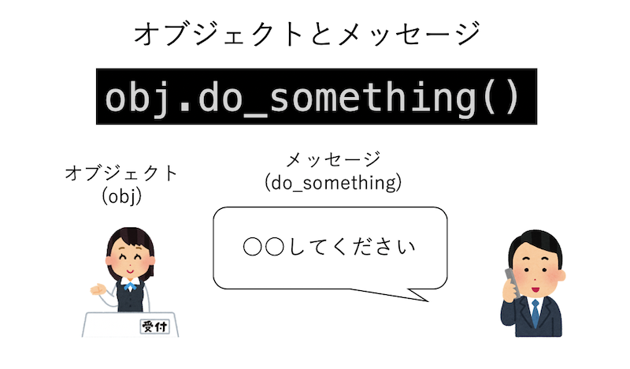
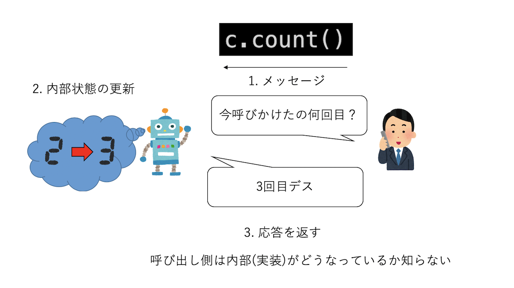
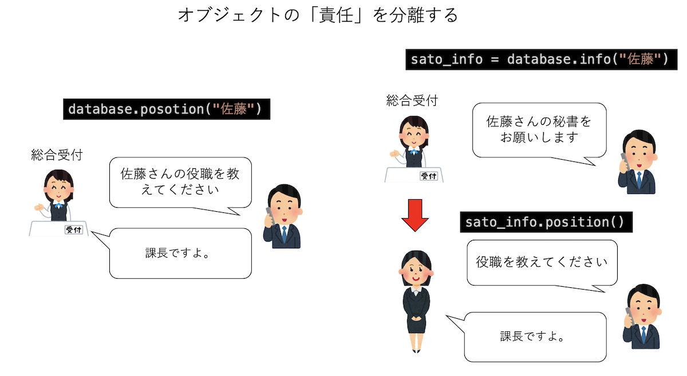

# [クラスとオブジェクト指向](https://kaityo256.github.io/python_zero/class/)

* オブジェクト指向とは？
* 割り箸ゲーム
* 余談：オブジェクト指向プログラミングの意義

## オブジェクト指向とは

オブジェクト指向とは何か。実は筆者にもよくわからない。この言葉の意味するところはプログラミング言語によって異なるし、人によっても違うイメージを持っているであろう。真面目に考え始めると深い沼にハマり、またうっかり「オブジェクト指向はこういうものだ」みたいなブログ記事を書いてしまうと怖い人々集まってくる。とりあえずここでは「オブジェクト指向とは、プログラミング技法の一種である」と思っておけば良い。

オブジェクト指向には、「オブジェクト」という概念が出てくる。これは「データ」と「振る舞い」をまとめたものだ。オブジェクト指向プログラミングでは、オブジェクトに何か処理を「依頼」することでなんらかの処理をする。この「依頼」を「メッセージ」と呼ぶ。Pythonでは、次のような形でオブジェクトにメッセージを送る。



```py
obj.do_somthing()
```

ここで、ピリオドの左にある`obj`がオブジェクトであり、メッセージを受け取るので「**レシーバ(reciever)**」と呼ばれる。ピリオドの右にある`do_something()`はメソッドと呼ばれる。Pythonでは、オブジェクトの持つメソッドを呼び出すことでメッセージを送る。オブジェクトは、自分の「状態」を持ち、メソッドという外部インタフェースを持つ。Pythonでは、「クラス」という雛形からオブジェクトを作る。

例えば、呼び出されるたびに、呼び出した回数を返すようなカウンターオブジェクトを作ってみよう。

```py
class Counter:
    def __init__(self):
        self.num = 0

    def count(self):
        self.num += 1
        print(self.num)
```

`class`というキーワードがクラスを作る宣言である。`__init__`というのはクラスの初期化のためのメソッドで、**コンストラクタ(constructor)**と呼ばれる。引数に`self`を指定するのが慣例となっている。ここで`self.num`という変数を宣言し、0に初期化している。`self.`をつけることで、このクラスの状態を保持する変数になる。このクラスに何かさせるためには、メッセージを送るためのメソッドが必要だ。ここでは`count`というメソッドを作った。やはり引数として`self`を指定し、`self.num`で呼ばれた回数をインクリメントしてから、その数字を表示している。

このクラスからオブジェクトを作って使ってみよう。

```py
c = Counter()
```


クラス名を関数のように呼び出すと、このクラスのオブジェクトが作られ、それが返される。この時、内部的に`__init__`が呼ばれている。こうして作られたオブジェクトを、元になったクラスの**インスタンス(instance)**と呼ぶ。

`c`がカウンターオブジェクトだ。このオブジェクトのメソッドを呼ぶことでメッセージを送ることができる。

```py
c.count() #=> 1
c.count() #=> 2
c.count() #=> 3
```



`c.count()`呼ぶ度に表示される数字が増えていくのがわかる。クラスから別のオブジェクトを作ることもできる。

```py
c2 = Counter()
c2.count() #=> 1
c2.count() #=> 2
```

新たに作られたカウンターオブジェクト`c2`は、自分自身の内部状態を持つ。

さて、こうして作ったカウンターの初期値はつねに0だが、任意の初期値を与えたくなったとしよう。この時、`__init__`に引数を渡すことで、初期値を与えるようにできる。

```py
class Counter:
    def __init__(self, ini = 0):
        self.num = ini

    def count(self):
        self.num += 1
        print(self.num)
```

```py
# 何も指定しなかった場合、初期値が0になる
c = Counter()
c.count() #=> 1
# 初期値を指定することもできる
c2 = Counter(10)
c2.count() #=> 11
```

オブジェクト指向プログラミングを行う理由はいくつかあるが、そのうちの大事なものの一つは「実装とインタフェースの分離」である。これは、実際の実装を隠蔽し、必要な部分のみメソッドとして公開することで責任の所在を明らかにし、将来の仕様変更に強くし、かつプログラマの負担を減らす。

オブジェクト指向には様々なキーワードが出てくる。例えば以下のようなものだ。

* オブジェクト
* クラス
* コンストラクタ
* インスタンス
* メッセージ
* カプセル化
* ポリモーフィズム
* 継承と合成

これらのについて「たとえ話」を使って説明することはできる。それを聞いて「ぼんやりとわかった気」にもなるだろう。しかし、個人的な経験では、オブジェクト指向の用語を「たとえ話」で「わかった気」になってもほとんど意味がない。オブジェクト指向はプログラミング技法であり、プログラムを組みながらその感覚を身につけるものだ。

そこで、本稿では詳細には触れず、とりあえずクラスを使ったプログラムを組んで、記述の仕方に慣れることを目標にしよう。今回の授業が終わった後に、

> ひな形であるクラスから作ったオブジェクトをインスタンスと呼び、インスタンスを作る時に呼ばれる特別なメソッドをコンストラクタと呼ぶ。オブジェクトは内部状態を持ち、メソッドというインタフェースを公開している。プログラマはメソッドを呼ぶことでオブジェクトにメッセージを送ることができる

という文章がだいたい理解できていればそれでよい。

## 割りばしゲーム

「割りばし」という二人で行う指遊びがある。地方によって名前やルールは様々だが、基本ルールは以下のようなものだ。

1. じゃんけんなどで先行、後攻を決め、お互い両手の人差し指を立てる
2. 先行は、自分の好きな手で相手の好きな手を攻撃する
3. 攻撃された側は、攻撃された手の指を、攻撃した手の指の本数だけ増やす
4. この時、もし指が5本以上になったらその手は死ぬ
5. これを交互に繰り返し、両手が死んだら負け


追加ルールやバリエーションとして、以下のようなものがある。

* modルール：攻撃されたとき、「ちょうど5」でなければ死なず、指の本数は5で割った余りになる
* 分身ルール：自分の手番で、手が一本死んでいるとき、指の総数が変わらないように両手に指を分けることができる
* 自分攻撃：自分の手で自分を攻撃することを許す

特にmodルールはかなり広い範囲で採用されているようだ。うちの地域では「割りばし」と呼ばれているものの、これが決定的な名前ではないらしく、Wikipediaでは[数字を増やす遊び](https://ja.wikipedia.org/wiki/%E6%89%8B%E3%82%92%E7%94%A8%E3%81%84%E3%81%9F%E9%81%8A%E3%81%B3#%E6%95%B0%E5%AD%97%E3%82%92%E5%A2%97%E3%82%84%E3%81%99%E9%81%8A%E3%81%B3)と紹介されている。

さて、簡単のため、基本ルールだけを考えよう。死んだ手の指の本数を「5本」と数えると、お互いの指の本数は、ターン毎に必ず増加する。したがって、千日手は存在しない。また、指の本数は20本を超えることはできないため、必ず有限ターンでゲームが終わる。また、勝負が決まるのは相手の最後の手を殺した時だけなので、引き分けは存在しない。ランダム要素もないため、先手か後手のどちらかが必勝であることがわかる。

実際、このゲームは後手必勝である。このゲームを題材に、クラスを使いつつ、本格的な再帰プログラムを組んでみよう。

# クラスとオブジェクト指向：課題

## 課題1:状態クラスの実装とユニットテスト

新しいノートブックを開き、`waribashi.ipynb`という名前をつけよ。

### 1. ライブラリのインポート

まず最初のセルに、後で必要となるライブラリをインポートしておこう。

```py
from graphviz import Digraph
import IPython
```

### 2. 状態クラスの実装

#### コンストラクタ

まず、割りばしゲームの「状態」を表すクラス`State`を実装しよう。このプログラムについてはクラスを作る意義はさほどないのだが、クラスの実装及びユニットテストの例としてクラスを作ることにする。余談だが、オブジェクト指向というとすぐにクラスを作ったり、無駄に継承したりさせたがるテキストが多いが、「本当にクラスが必要か」「継承が必要か」は常に考える必要がある。

割りばしゲームの状態としては、先手番であるか否か、先手番の指の本数、後手番の指の本数がある。また、「自分から遷移可能な状態」のリストも持っておこう。後で描画に必要となるので「すでにこの状態を描画したかどうか」のフラグもつけておこう。2つ目のセルに以下を入力せよ。

```py
class State:
    def __init__(self, is_first, f, s):
        self.is_first = is_first
        self.f = [max(f), min(f)]
        self.s = [max(s), min(s)]
        self.siblings = []
        self.is_drawn = False
```

入力したら、インスタンスを作れることを確認しよう。3つ目のセルに以下のように入力、実行し、エラーが出なければ成功である。

```py
s = State(True,[1,1],[1,1])
```

確認が終わったら、3つ目のセルを削除しておくこと。

#### 文字列変換メソッド

次に、状態を文字列に変換するメソッドを追加しよう。2つ目セルの`State`クラスの`__init__`メソッドの後に`__str__`というメソッドを追加する。この時、`__init__`と同じインデントにすること。

```py
class State:
    def __init__(self, is_first, f, s):
        self.is_first = is_first
        self.f = [max(f), min(f)]
        self.s = [max(s), min(s)]
        self.siblings = []
        self.is_drawn = False

    def __str__(self):
        s = str(self.f) + "\n" + str(self.s)
        if self.is_first:
            return "f\n" + s
        else:
            return "s\n" + s
```

追加したらこのセルを再度実行してから、3つ目のセルで以下を実行せよ。

```py
s = State(True,[1,1],[1,1])
print(s)
```

以下のような出力がされれば正しく実装できている。

```py
f
[1, 1]
[1, 1]
```

これは以下のように動作している。

1. `State`オブジェクト`s`が`print`に渡されると、`print`は`s`を文字列に変換するために`str(s)`を呼ぶ
2. `str(s)`は、内部で`s.__str__()`を呼んで、その値を返す
3. `s.__str__()`の返す値が`print`に渡され、それが出力される。

このような、`__str__`のようにアンダースコアが前後に二つついたメソッドを特殊メソッドと呼ぶ。ほかにはサイズを返す`__len__`や比較のためのメソッド`__eq__`などがある。

さて、実装した単位ごとに動作が意図通りになっているか確認することを「ユニットテスト」と呼ぶ。さて、先ほどの表示だけではテストとしては不十分である。ここまで実装しただけでも、

* 先手番なら「f」を、後手番なら「s」を表示する(それぞれfirst, secondの略である)。
* 先手番を上段に、後手番を下段に表示する
* 指の本数が多いほうを左に、少ないほうを右に寄せている

という機能がある。これらが正しく動作するか、それぞれチェックしよう。3つ目のセルを以下のように修正せよ。

```py
s = State(True,[1,1],[1,1])
print(s)
s2= State(False,[1,1],[1,1])
print(s2)
s3 = State(True,[3,1],[2,4])
print(s3)
```

これは、

* `s`: `str(s)`が正しく実行されるかどうか
* `s2`: 先手番、後手番の設定と表示が正しいかどうか
* `s3`: 先手番が上段、後手番が下段に表示されているか、また指の本数に関するソートが正しいか

をそれぞれ確認するテストになっている。本当は複数の項目を同時にテストするのは良くないのだが、ここは大目に見てもらおう。

以下のように表示されれば成功である。

```py
f
[1, 1]
[1, 1]
s
[1, 1]
[1, 1]
f
[3, 1]
[4, 2]
```

上記が正しく表示されたら、3つ目のセルを消しておこう。

プログラムの初学者にとっては、プログラミングにおいて「プログラムを入力する時間」が大半を占めることだろう。しかし、慣れてくるとプログラミングの時間の大半をデバッグに費やすようになる。プログラムのできる人とできない人の生産性は軽く桁で変わってくるが、その大きな要因の一つが「上級者はバグを入れない、入れてもすぐにとる」ことである。そのためにはテストが欠かせない。最初はどこをどれくらいテストすれば良いかわからないと思うが、とりあえずしつこいくらいにテストを書くとよいだろう。そのうち「自分がどこにバグを入れやすいか」すなわち「どこをテストすべきか」の感覚がつかめてくる。

#### 比較メソッド

次に、オブジェクトの比較メソッド`__eq__`を作ってみよう。比較メソッドとは`a == b`とした際に、`a`と`b`が等しいか判定するのにつかわれるメソッドだ。実は比較メソッドがなくても比較ができる。3つ目のセルの中身を以下のように書き換えよう(一度消して、新しいセルを作ってもかまわない)。

```py
s1 = State(True, [1,1],[1,1])
s2 = State(True, [1,1],[1,1])
s1 == s2
```

全く同じ状態であるにも関わらず、結果は`False`になるはずだ。これは、Pythonではオブジェクトの比較が、デフォルトでは中身ではなくオブジェクトIDの比較になるためだ。実際、さきほどの二つは中身は同じだが異なるオブジェクトなので、IDは異なる。

```py
s1 = State(True, [1,1],[1,1])
s2 = State(True, [1,1],[1,1])
print(id(s1))
print(id(s2))
```

上記を実行すると、2つの異なるIDが表示されたはずである。さて、この「IDは異なるが同じ内容を持つオブジェクト」を「等しい」と判定するために`__eq__`メソッドを実装しよう。2つ目のセルの`State`クラスの`__str__`の後に以下のように追加しよう。

```py
    def params(self):
        return (self.is_first, self.f, self.s)

    def __eq__(self, other):
        return self.params() == other.params()
```

`params`は、自分の状態をタプルとして返す関数で、`__eq__`は、二つのオブジェクトの`params()`の返り値を比較して等しいかどうかを判定している。これを実装後、先ほどの3つ目のセルを再度実行してみよう。

```py
s1 = State(True, [1,1],[1,1])
s2 = State(True, [1,1],[1,1])
s1 == s2
```

実行して、今度は`True`と出てくれば成功である。また、これにより自動的に`in`が使えるようになる。3番目のセルを以下のように修正してみよう。

```py
s1 = State(True, [1,1],[1,1])
s2 = State(True, [1,1],[1,1])
s3 = State(False, [1,1],[1,1])
a = [s1]
print(s2 in a) # => True
print(s3 in a) # => False
```

「状態」のリストが与えられたとき、そのリストに同じ状態が入っているかどうか`in`で確認できるようになった。これも後で使う。

動作確認が終わったら3つ目のセルを消しておくこと。

#### 次の状態の生成

せっかく状態クラスを作ったので、次の状態の生成もこのクラスにやらせよう。現在の状態に対して「先手側の手の左右」と「後手側の手の左右」を選べば、次の状態が決まる。先手側の手を`fi`、後手側の手を`si`としよう。それぞれ0と1の値をとる変数で、0が左手、1が右手である。ただし、指の本数が大きいほうを必ず左手にするように入れ替える。例えば現在先手番で、`(fi, si)==(0,0)`ならば、先手が左手で後手番の左手を攻撃したという意味になり、現在後手番で`(fi, si)==(0,1)`ならば、後手番が右手で先手番の左手を攻撃した、という意味になる。

以上を実装してみよう。2つ目のセルの`State`クラスに以下のメソッドを追加せよ。

```py
    def next_state(self, index):
        fi, si = index
        if self.f[fi] == 0 or self.s[si] == 0:
            return None
        d = self.f[fi] + self.s[si]
        f2 = self.f.copy()
        s2 = self.s.copy()
        if d >= 5:
            d = 0
        if self.is_first:
            s2[si] = d
        else:
            f2[fi] = d
        return State(not self.is_first, f2, s2)
```

このメソッドの機能は

* 現在の状態に、「先手と後手のどの手が選ばれたか」のタプルを与えたら次の状態を作って返す
* もし選ばれた手の指の本数が0なら(死んでいたら)`None`を返す
* もし攻撃の結果、指の本数が5本を超えたら0にする(その手が死ぬ)

である。

追加したら、正しく実装できたか確認してみよう。3つ目のセルに以下を入力して出力を確認せよ。`next_state`の引数はタプル`(0,0)`であるので、`s1.next_state((0,0))`と内側の括弧が二重になり、さらに`print`の括弧で三重になることに注意。

```py
s1 = State(True, [1,1],[1,1])
print(s1.next_state((0,0)))
```

以下のような出力が出てくるはずである。

```py
s
[1, 1]
[2, 1]
```

ついでに、「必ず左手が大きくなるように手を入れ替える」「5を超えると手が死ぬ」ことも確認しよう。

```py
s1 = State(True, [3,2],[3,1])
print(s1.next_state((1,0)))
```

先手番が指(3,2)、後手番が(3,1)の状態を作り、先手番の右手で後手番の左手を攻撃した状態が表示されることが期待される。結果は、

```py
s
[3, 2]
[1, 0]
```

と、現在後手番であり、先手番の手は変わらず、後手番は左手が死んだため、左右を入れ替えて左手が指一本、右手が死亡、という状態になった。なお、繰り返しとなるが、本当は複数のテストを同時にしてはいけない。AとBという機能がある場合、Aのテスト、Bのテスト、そしてAとBが両方絡むテストをすべきである。そのあたりに興味がある人は「ユニットテスト」「継続的インテグレーション」などのキーワードで調べて欲しい。

最後に、有効では無い手を入力したら`None`が変えることも確認する。

```py
s1 = State(True, [1,0],[1,1])
print(s1.next_state((1,1)))
```

これは先手の右手が死んでいるのに、右手で相手の右手を攻撃しようとしているために合法手ではない。したがって`None`が返る。

最終的に2つ目のセルにある`State`クラスはこんな形になったはずである。

```py
class State:
    def __init__(self, is_first, f, s):
        self.is_first = is_first
        self.f = [max(f), min(f)]
        self.s = [max(s), min(s)]
        self.siblings = []
        self.is_drawn = False

    def __str__(self):
        s = str(self.f) + "\n" + str(self.s)
        if self.is_first:
            return "f\n" + s
        else:
            return "s\n" + s

    def params(self):
        return (self.is_first, self.f, self.s)

    def __eq__(self, other):
        return self.params() == other.params()

    def next_state(self, index):
        fi, si = index
        if self.f[fi] == 0 or self.s[si] == 0:
            return None
        d = self.f[fi] + self.s[si]
        f2 = self.f.copy()
        s2 = self.s.copy()
        if d >= 5:
            d = 0
        if self.is_first:
            s2[si] = d
        else:
            f2[fi] = d
        return State(not self.is_first, f2, s2)
```

以上で状態クラスは完成である。ここまで正しい動作が確認できていれば、確認のための3つ目のセルは削除して良い。

## 課題2:状態遷移図の可視化

### ゲーム木の作成

割りばしゲームの状態遷移図(ゲーム木)を作るには、

1. まず状態が与えられた時、その状態から遷移可能な状態を生成する
2. その状態が合法手であれば、自分にそれを追加する
3. 追加したすべての状態について、再帰的に以上を繰り返す

という処理をすれば良い。

ただし、異なるパスで同じ状態に遷移する可能性があり、それらを「同じノード」としてまとめたいため、それをハッシュで実装する。具体的には、生成された状態の文字列をキーとしてハッシュに登録し、ハッシュに登録済みの状態ならその状態を、そうでなければ登録する、という処理を加える。

#### 3. 関数`move`の実装

「次の合法手」を探索する関数`move`を3つ目のセルに入力せよ(3つ目のセルが残っていたらまず削除すること)。

```py
def move(parent, is_first, nodes):
    for i in [(0, 0), (0, 1), (1, 0), (1, 1)]:
        child = parent.next_state(i)
        if child is None:
            continue
        if child in parent.siblings:
            continue
        s = str(child)
        child = nodes.get(s, child)
        nodes[s] = child
        parent.siblings.append(child)
        move(child, not is_first, nodes)
```

やっていることは以下の通り。

1. 現在の状態から遷移可能な4状態を生成する
2. それぞれが合法手であるか確認し、合法手でなければスキップ
3. もしすでに自分に追加されている状態ならスキップ
4. すでにハッシュ登録済みかチェック、登録済みなら登録した状態を取得、そうでないなら今作成した状態を登録する
5. 親に作成したノードを追加して、そのノードを親として再帰

#### 4. 状態木を作成する関数`make_tree`の実装

次に、`move`に最初の状態を与えて、ゲーム木の「根(root)」を作って返す関数を作る。4つ目のセルに以下の関数を入力せよ。

```py
def make_tree():
    nodes = {}
    root = State(True, [1, 1], [1, 1])
    nodes[str(root)] = root
    move(root, True, nodes)
    return root
```

ここまで入力したら、5つ目のセルに以下を入力して実行し、エラーがでないことを確認せよ。

```py
root = make_tree()
print(root)
```

最初の状態が以下のように表示されるはずである。

```py
f
[1, 1]
[1, 1]
```

動作確認が終わったら、5つ目のセルは消してかまわない。

#### 5. ゲーム木の可視化関数`make_graph`の実装

先ほど`root = make_tree()`で作成した`root`は子ノードがぶら下がっており、さらに子ノードには孫ノードが・・・と木構造を作っている。これをGraphvizで可視化しよう。

5番目のセルに、以下のプログラムを入力せよ。

```py
def make_graph(node, g):
    if node.is_drawn:
        return
    node.is_drawn = True
    ns = str(node)
    if max(node.f) == 0:
        g.node(ns, color="#FF9999", style="filled")
    elif max(node.s) == 0:
        g.node(ns, color="#9999FF", style="filled")
    else:
        g.node(ns)
    for n in node.siblings:
        g.edge(ns, str(n))
        make_graph(n, g)
```

#### 6. ゲーム木の可視化

ここまでで上から

1. import文
2. `State`クラスの宣言
3. `move`関数
4. `make_tree`関数
5. `make_graph`関数

の5つのセルができているはずだ。それぞれが実行されていることを確認した後(不安なら再度実行した後)、一番下の6つ目のセルに以下を入力、実行せよ。

```py
root = make_tree()
g = Digraph(format="png")
make_graph(root, g)
g.render("tree")
IPython.display.Image("tree.png")
```

ここまで正しく実装されていれば、ゲーム木が表示されるはずである。青が先手勝利、赤が後手勝利である。大きすぎて見づらい場合は、右クリックから「新しいタブで画像を開く」を選ぶと見やすいかもしれない。

## 課題3: 木構造の編集

さて、無事にゲーム木(しつこいが正確には木構造ではなく有向グラフである)が表示されたが、そのグラフを見ても何がなんだかわからないであろう。そこで、このゲームが後手必勝であることをプログラムで確認してみよう。

まず、引き分けがないのだから、負けにつながる手を打たなければ勝てるはずである。先手に勝ち筋がある場合、当然先手はその手を打つ。したがって、後手は「先手に勝ち筋があるような状態につながる手」を打ってはならない。そこで、そこにつながる手を自分の子ノードリストから削除しよう。また、そうして削除していった結果、打てる手がなくなってしまうノードが出てくる(その状態になった時点で敗北確定)。このようなノードにつながる手も打ってはならないので、それも枝刈する。

以上を実装するためには、木をたどっていって、

* もし先手番が勝っていたら`True`を返す(勝ちが決まっているので、ここは末端ノードである)。
* もし現在後手番で、自分から直接つながる先手番に勝ちがあるなら(Trueが返ってきたら)そのノードを削除する。
* もし削除した結果、子ノードがひとつもなくなったら、自分は「負けにつながる手」なのでTrueを返す

という処理をしてやれば良い。

#### 7. 枝刈り関数`prune`の実装

7つ目のセルに、枝を刈るための関数`prune`を実装せよ。

```py
def prune(node):
    if max(node.s) == 0:
        return True
    if node.is_first:
        for n in node.siblings:
            if prune(n):
                return True
        return False
    if not node.is_first:
        sib = node.siblings.copy()
        for n in sib:
            if prune(n):
                node.siblings.remove(n)
        if not node.siblings:
            return True
    return False
```

先程のアルゴリズムの通りに実装しただけだが、再帰に慣れていないと理解しづらいかもしれない。もしわからなくても「そういうものだ」と思って今はスルーしてかまわない。

#### 8. 枝刈り後のゲーム木の表示

8つ目のセルに、枝刈りをした後のゲーム木を表示するプログラムを書こう。

```py
root = make_tree()
prune(root)
g = Digraph(format="png")
make_graph(root, g)
g.render("tree")
IPython.display.Image("tree.png")
```

6つ目のセルの二行目に`prune(root)`を追加しただけなので、6つ目のセルの内容をコピペして編集しても良い。正しく実装できてれば、青い状態、つまり先手勝利の状態が消え、赤い状態しかない木、つまり後手必勝の遷移図が出てきたはずである。これを見ると、先手がどのような手を打とうとも、後手が最善手を打つと、必ず後手勝利になることがわかる。

## 発展課題

隣の人と実際にこの図に従って「割りばし」ゲームをやってみて、どのようにしても後手必勝であることを確認せよ。

## 余談：オブジェクト指向プログラミングの意義

オブジェクト指向プログラミングの意義を短時間で伝えるのは難しい。おそらく講義中に触れることはできないであろう。ここでは「余談」として、より学びたい人のために簡単な実例を挙げておこう。

いま、株式会社「Hoge」があり、その社員の名簿がある。社員は社員IDとメールアドレス(例えば`sato@hoge.co.jp`)を持っている。プログラマである田中君は、それをリストで実装した。

```py
name = ["佐藤","鈴木","高橋","田中"]
address = ["sato", "suzuki", "takahashi","tanaka"]
```

メールアドレスの`@`の右側は全員同じなので、`@`の左側の部分だけ保存されている。例えば鈴木さんは社員番号1番であり、メールアドレスは

```py
sato_address = address[1] + '@hoge.co.jp'
```

で取得できる。さて、この会社が戦略的な理由により、子会社「Fuga」を作成し、高橋さんが社長としてその会社に移ることになった。田中くんは「メールアドレスの`@`の右側は全社員同じ」という前提でプログラムを作ってしまっていたので、全プログラムの社員アドレスを取得している箇所を修正しなければならない。

また、子会社ができたことにより、社員番号の扱いも変えなければならない。高橋さんは子会社`Fuga`の社員番号0番であるべきだ。どうしよう？別に所属会社と社員番号のリストを作るべきだろうか？今後両方に所属する人が出てきたら？今後何か変更があるたびにプログラムを全部書き直しなければならないだろうか？

上記のプログラムは、「名前やアドレスを管理したい」という「目的」と、「それをどう実現するか」という「実装」がべったりくっついているところに問題があった。オブジェクト指向プログラミングでは、「目的(振る舞い)」と「実装」を分離する。

実装はともかく、社員データベース`database`があり、そこに社員名を問い合わせればアドレスを教えてくれるようになっているとしよう。イメージはこんな感じである。

```py
takahashi_address = database.address("高橋") #=> takahashi@fuga.co.jp
tanaka_address = database.address("田中") #=> tanaka@hoge.co.jp
```

こうしておくと、将来子会社が増えた時、`database`の内部実装は変更する必要があるが、`database`に問い合わせている上記の部分のプログラムを修正しなくて良い。

このプログラムは全社員に通し番号で社員番号を付与しているかもしれないし、会社ごとに異なるデータベースを持っているかもしれない。しかし、そんなことはプログラマは気にしなくて良い。

さて、今度は佐藤さんの役職も知りたいとしよう。こう書きたくなるだろうか？

```py
sato_position = database.posotion("佐藤") #=> 課長
```

オブジェクト指向に慣れた人なら、上記のプログラムに違和感を感じるだろう。「データベースに聞けばなんでも教えてくれる」ということは、「データベースが全ての情報を把握している」ということである。会社で「とにかくなんでもこの人に聞け」という人がいたら、その人の責任が過大であり、危険信号であることは想像できるであろう。

そこで、データベースは名前から「社員情報」というオブジェクトを返すことにして、細かい情報はそのオブジェクトに教えてもらおう。総合受付から担当秘書を教えてもらい、詳細は担当秘書に教えてもらうイメージだ。

```py
sato_info = database.info("佐藤")
sato_position = sato_info.position() # => 課長
```



一度、社員情報というオブジェクトを挟むことで、

* データベースオブジェクト(総合受付)は、名前から社員情報を返すのが仕事
* 社員情報は、担当する社員についての情報を担当(他の社員については知らない)

と、「誰がどこまで責任をもっているか」が明確になり、かつ「オブジェクト同士の責任が重なる」こともない。

ちなみに`sato_info`を消して、メソッド呼び出しをピリオドでつなげることもできる。

```py
sato_info = database.info("佐藤").position() #=> 課長
```

オブジェクト指向に慣れたプログラマは「こういうオブジェクトはこういう振る舞いをして欲しい」とか「このオブジェクト(クラス)の責任が多すぎるな」といった「お気持ち」を持つ。この「お気持ち」に沿ってプログラムを組むと、バグが少なかったり、将来の仕様変更に強いプログラムができる。オブジェクト指向はそういう「プログラミングノウハウ」を形として具現化したものだ。ある程度大きなプログラムを組んでみないと、このあたりの感覚を身につけることは難しい。

本稿も含めて、巷にあるオブジェクト指向の説明においては「たとえ話」が頻出する。たとえ話はなんとなくイメージを掴むのには有用であるが、オブジェクト指向がプログラミング技法である以上、いくらわかった気になっても実際に使えなければ意味がない。あくまでもプログラムの具体例に数多く触れ、何がうれしいのかを積み重ねていくのが、結局オブジェクト指向の理解の早道であろう。
