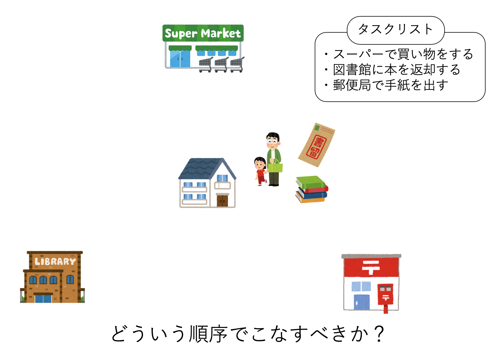
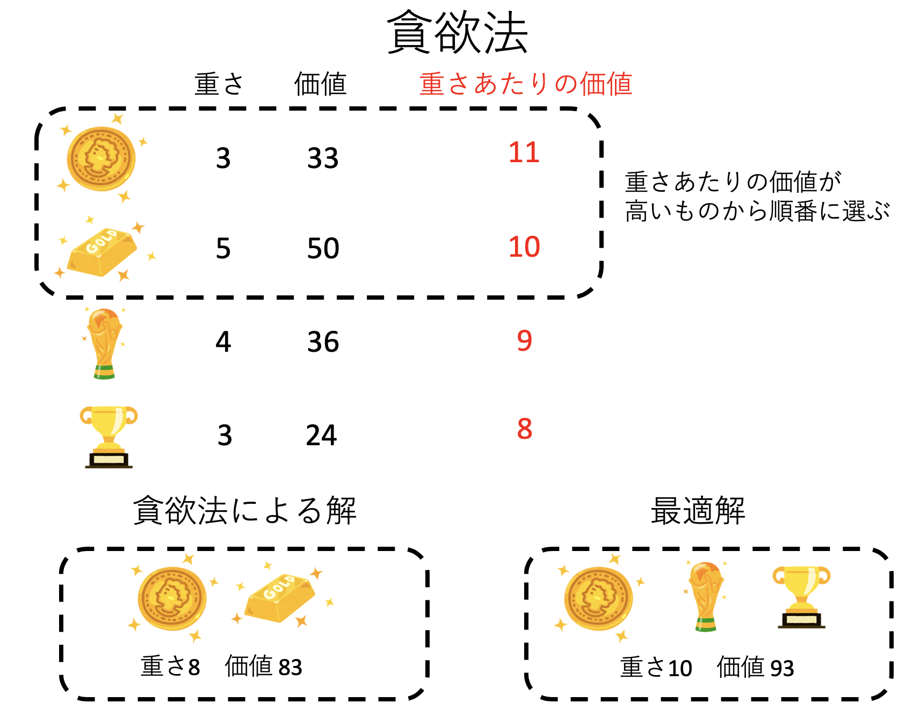
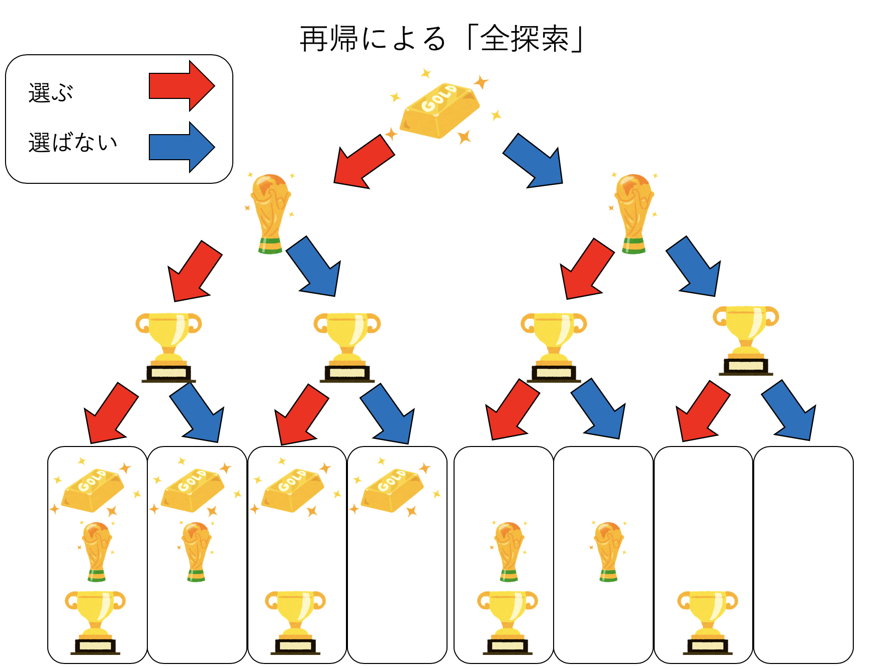
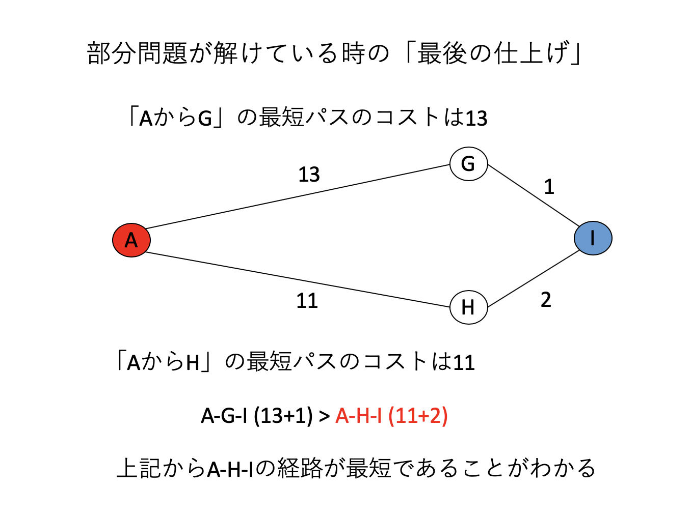

# [動的計画法](https://kaityo256.github.io/python_zero/dp/)

## 本講で学ぶこと

* 組み合わせ最適化問題
* 貪欲法
* 全探索
* メモ化再帰による動的計画法
* 余談：人外について

## 最適化問題



いま、あなたは以下の三つのタスクをこなす必要があるとしよう。

* スーパーで食材の買い物をする
* 郵便局で封筒を簡易書留で出す
* 借りていた本を図書館に返しに行く

実行順序は自由だ。どうせならなるべく楽にすべてのタスクをこなしたい。簡単のため、スーパー、図書館、郵便局は家から等距離にあるとしよう。どのような順番でタスクをこなすべきだろうか？


もし「スーパー」「郵便局」「図書館」という順序でタスクをこなすと、あなたは「重い本を持ちながらスーパーで買い物をして」「スーパーで購入した食材と本を持ちながら郵便局に行き」「最後に本を返す」ということになり、手が疲れてしまう。この場合は「図書館」「郵便局」「スーパー」の順番が良いだろう。まずは重い本をなんとかし、荷物が軽い状態で郵便局のタスクをこなし、最後に食材を買って帰れば、疲れは最小限で済む。

このように、我々は日常的に「何かの条件を満たしつつ、何かを最適化する」という問題に直面しており、「要領の良い人」は、普段からこのような最適化問題を無意識に解いている。しかし、これらの問題の多くは「最適解」を得ることが難しい「NP困難 (NP-hard)」な問題であることが多い。「NP困難」については深く立ち入らないが、ようするに「最適解を得るには全ての組み合わせを調べるしかなく、要素数が増えると計算時間が爆発してしまう」という問題のことである。このような問題は、応用上は必ずしも厳密解を得る必要はなく、近似解が求まればそれで十分な場合も多いため、高速に近似解を求める手法も数多く提案されている。しかし、ある種の組み合わせ問題は効率的に解くことができる。その際に使われる手法が本講で紹介する「動的計画法」である。

## ナップサック問題


これまで、どこかで「ナップサック問題」という言葉は聞いたことがあるだろう。例えばこんな問題である。あなたは洞窟の奥で見事宝物庫を見つけた。そこには重さと価値がまちまちな「宝物」が４つあった。

それぞれの重さと価値が以下のように与えられているとしよう。

* 金の延べ棒: 重さ 5、価値 50
* トロフィー: 重さ 4、価値 36
* カップ: 重さ 3、価値 24
* コイン: 重さ 3、価値 33

あなたは重さの合計「10」までしか持ち歩くことができないので、全てを持ち帰ることはできない。ではどの品物を持ち帰れるのが一番「得」であろうか？

このように「たくさんの物のセットが与えられ、何かの条件(ここでは重さの総和)を満たしつつ、何かの価値を最大化するような組み合わせを探す」という問題は、「組み合わせ最適化問題」と呼ばれる。ナップサック問題は典型的な組み合わせ最適化問題の一つである。

あまり意識していないかもしれないが、我々は日常的に組み合わせ最適化問題を解いている。例えばレストランでメニューを見ながら何を食べるか決める時、当然ながら美味しいものを食べたいと思うことであろう。しかし、美味しい物は一般に値段もカロリーも高いというのがこの世の摂理である。そこで、「ある程度の予算、カロリーの制限内で、一番幸せ度が高いメニューの組み合わせ」を探すことになる。これは典型的なナップサック問題である。

## 貪欲法

さて、動的計画法を考える前に、近似解を求める方法を紹介しよう。組み合わせ最適化の近似解を求める方法はたくさんあるが、その中でも一番簡単な「貪欲法(Greedy Method)」を紹介する。

ナップサック問題において、ある重さ以内で最大の価値を得たいのだから、理想的には最大の重さまで詰めて、かつ価値を最大化したい。したがって、一つ一つの品物についても、「重さあたりの価値」が高いものを選びたくなるであろう。そこで、「重さあたりの価値」について高い順に並べて、上から順番に選んで行く、というアルゴリズムが考えられる。これが貪欲法である。

先程の「宝物」の問題を考えて見よう。それぞれについて「重さあたりの価値」を計算し、それが高い順に並べてみる。

* コイン: 重さ 3、価値 33、重さあたりの価値 11
* 金の延べ棒: 重さ 5、価値 50、重さあたりの価値 10
* トロフィー: 重さ 4、価値 36、重さあたりの価値 9
* カップ: 重さ 3、価値 24、重さあたりの価値 8

「得られたリストを上から順番に持てるだけ持つ」のが貪欲法である。この場合は、まずコインを選び、次に金の延べ棒を選んだ時点で重さが「8」となるため、もう他の品物を選ぶことはできない。貪欲法による結果は「重さ8、価値83」となった。実際には「コイン、トロフィー、カップ」の組み合わせで「重さ10、価値93」が最適解であるため、それには及ばない。



しかし、一般的に貪欲法は(よほど狙ってそう問題を作らない限り)わりと良い近似解を与えることが多く、問題によっては最適解を与えることもある(ダイクストラ法など)。「とにかく選ぶべきものに評価値を与え、一番良いものから順番に選び、制約に達したらやめる」という簡単なアルゴリズムであり、汎用性もあることから、覚えておいて損はないアルゴリズムである。

## 全探索

「全探索」とは、その名の通りすべての可能性を列挙してしまう方法である。組み合わせ最適化問題について全探索すれば、当然のことながら最適解が得られるが、探索すべき組み合わせが問題サイズに対して急激に(指数関数的に)大きくなるため、ある程度以上大きな問題には適さない。しかし、全探索はすべての探索アルゴリズムの基本であるので、ここで簡単に触れておきたい。

先程の「宝物」の問題では、重さと価値が以下のように与えられてた。

* 金の延べ棒: 重さ 5、価値 50
* トロフィー: 重さ 4、価値 36
* カップ: 重さ 3、価値 24
* コイン: 重さ 3、価値 33

これを、上から順番に「選ぶ」「選ばない」の二択で探していく。



上図ではスペースの関係から3種類、8通りしか示していないが、基本的に$N$個の品物があれば、それぞれについて選ぶ、選ばないの二通りがあるため、$2^N$通りの選び方がある。なお、途中で「重さオーバー」した場合はそれ以上探索はしない。

前述の通り、全探索アルゴリズムは問題サイズに対して指数関数的に計算量が増えていくため、実用には適さない。しかし、全探索はすべてのアルゴリズムの基本であり、かつ要素数が数十個くらいまでであれば全探索の守備範囲となる。例えば$N=30$でも$2^{30} \sim 1.1 \times 10^9$であり、最近の計算機ならまだ余裕である。再帰を使った全探索コードは短く、たまに便利なので、これもすぐに組めるようになっておきたい。

## 動的計画法とは

さて、「貪欲法」は簡単だが近似解しか得られず、「全探索」は厳密だが探索時間がかかりすぎる。ここでは「厳密」で、かつ「効率的」に解を得られる **動的計画法 (Dynamic Programming, DP)** について説明しよう。「動的計画法」という、難しそうな名前がついているが、そのアルゴリズムの骨子はさして難しくない。動的計画法が適用できる条件は、以下の二つである。

* 大きな問題を、より小さな問題に分解できること (分割統治)
* 分解された小さな問題の結果が、再利用可能であること (メモ化)

ナップサック問題でも動的計画法の説明はできるが、より説明がわかりやすい「最適経路探索問題」を例に動的計画法の説明をする。

あなたは旅行を計画している。目的値に到着するのに、複数の経路があるのだが、できるだけ早く、もしくはできるだけ安く到着したい。どのような経路を取ればよいだろうか？いま、この経路をグラフで表現すると以下のようになるとする。


あたたはA地点からI地点までいきたい。そのための経由地(例えば電車の駅だと思えばよい)がBからHまである。それぞれの地点間にはコストが定義されている。この場合のコストは時間もしくは料金である。

先程の最短経路探索問題の回答は、以下のようなものだ。


A→B→E→C→F→H→I

この時、最短経路は13になる。さて、この経路をよく見てみよう。いま、最短経路がこのように定まったとしよう。AからEを経由してIに到達している。この時、「AからE」への経路も最短であり、「EからI」への経路も最短となっている。


このように、最短経路問題は「もし最短経路が求まったのなら、その途中の任意の二点間の経路も最短である」という性質をもっている。もしこの性質が満たされていないとしよう。例えば上記では、「AからE」の最短経路のコストは3であり、「EからI」の最短経路のコストは10、あわせて「AからI」へのコストは13となっている。もし「AからE」に、コスト2以下のパスがあるならば、そちらを採用すれば、「AからI」のコストを下げることができる。これは「AからIへの最短経路が求まった」という条件と矛盾する。以上から「最短経路の任意の二点間の経路も最短である」ことがわかる。



これがどのように問題を解くのに使えるか考えてみよう。いま知りたいのは「AからI」までの最短経路である。しかし、それより小さい問題、「AからG」までの最短経路と、「AからH」までの最短経路がわかっているものとしよう。それぞれ「A-G」のコストが13、「A-H」のコストが11である。すると、「GからI」のコストが1、「HからI」のコストが2であることがわかっているので、AからG経由でIに行く最短パスのコストは14、AからH経由でIに行くコストは13となり、A-H-Iの経路が最短であることがわかる。

こうして、「問題が部分的に解けている」ならば、それを「再利用」することでより大きな問題が解けるでしょう、というのが動的計画法の骨子である。

# 動的計画法：課題

## 課題1：サイゼリヤ問題

組み合わせ最適化問題の例として、サイゼリヤ問題を取り上げよう。サイゼリヤ問題とは「N円持ってサイゼリヤに行ったら最大でどれだけのカロリーを摂取できるか」という問題である。ただし、同じメニューを重複して注文してはいけないことにする。これは典型的なナップサック問題である。サイゼリヤのメニューは日々変わっているが、ここではある時点でのメニュー、114品の金額とカロリーのデータを使い、最終的に「サイゼリヤに一万円を握りしめていったら、最大何kcalを摂取できるか」という問題を解く。

以下、サイゼリヤ問題を貪欲法、全探索、動的計画法の三種類の方法で解くことにする。新しいノートブックを開き、`saizeriya.ipynb`として保存せよ。

### 課題1-1：データの読み込み

#### 1. ライブラリのインポート

まずはデータを読み込もう。いつも通り最初のセルで必要なものをimportする。

```py
import pickle
from collections import defaultdict
```

#### 2. データのロード

次に、データをロードしよう。二つ目のセルに以下を入力する。

```py
FILE='https://kaityo256.github.io/python_zero/dp/saizeriya.pickle'
!wget $FILE
```

最後に`‘saizeriya.pickle’ saved [5293/5293]`と表示されれば成功だ。

#### 3. データの読み込み

先程ダウンロードしたファイルは、pickleというライブラリでシリアライズされたデータである。これを読み込んでみよう。三つ目のセルに以下を入力せよ。

```py
with open('saizeriya.pickle', 'rb') as f:
    names, prices, cals = pickle.load(f)
names
```

これは、114種類のメニューそれぞれの、名前、価格、カロリー(kcal)のリストである。読み込めたかどうか確認うるため、セルの最後で`names`を評価している。`「['彩りガーデンサラダ', '小エビのサラダ',,,'コーヒーゼリー','トリフアイスクリーム']`と表示されれば正しく読み込めている。

### 課題1-2：貪欲法

読み込んだデータに対して、貪欲法を実装しよう。貪欲法をサイゼリヤ問題に当てはめると「値段あたりのカロリー」が高いものから順番に選び、予算を超えたらそこでストップ、というアルゴリズムとなる。アルゴリズムとしては以下のようになる。

* メニューを「値段あたりのカロリー」で降順にソートする
* ソートした結果を上から順番に注文していく。ただし、予算オーバーするなら次を試す
* 全てのメニューを調べたら終了

#### 4. 貪欲法の実装

4つ目のセルに、以下を入力せよ。

```py
def greedy(budget):
  ind = list(range(len(names)))
  ind = sorted(ind, key=lambda x: cals[x]/prices[x], reverse=True)
  psum = 0
  csum = 0
  for i in ind:
    if psum + prices[i] >= budget:
      continue
    psum += prices[i]
    csum += cals[i]
    print("{} {} Yen {} kcal".format(names[i], prices[i], cals[i]))
  print("Total {} Yen, {} kcal".format(psum,csum))
```

ここで、

```py
  ind = list(range(len(names)))
  ind = sorted(ind, key=lambda x: cals[x]/prices[x], reverse=True)
```

が、「メニューを価格あたりのカロリーでソートする」部分である。`list(range(len(names)))`は`[0,1,2,...,113]`という連番のインデックスを持つリストを作る部分である。このインデックスを、ある基準`key`でソートするようラムダ式で指定している。ラムダ式というと難しく聞こえるが、要するに

```py
lambda x: cals[x]/prices[x]
```

とは、「x」という値が与えられたら、`cals[x]/prices[x]`を返しなさい、という意味で、

```py
def key(x):
    return cals[x]/prices[x]
```

を一行で書いただけである。これにより、「値段あたりのカロリー」でソートできるが、`sorted`はデフォルトで昇順にソートするため、降順にするために`reverse=True`を指示している。

#### 5. 貪欲法の実行

早速貪欲法を実行してみよう。5つ目のセルで、以下を実行せよ。

```py
%%time
greedy(1000)
```

さいしょの`%%time`は「実行時間を計測せよ」という意味だ。1000円で最大のカロリーを得るためのメニューが表示されたはずである。

さらに「一万円を握りしめてサイゼリヤにいったら、最大何kcalを摂取できるか」も考えてみよう。`1000`を`10000`に変えて

```py
%%time
greedy(10000)
```

を実行せよ。結果はどうなるだろうか？出てきたメニューを見た感想を述べよ。

### 課題1-3：全探索

動的計画法を実装する前に、全探索コードを書いてみよう。いま、メニューが114個ある。全てのメニューについて「注文する/しない」を選ぶと、全体で$O(2^N)$の手間がかかる。ただし、すでに予算を超えている時に、さらに追加でメニューを注文する必要はないので、その部分は枝刈をする。これをナイーブに再帰で書いてみよう。

#### 6. 全探索関数`search`の実装

`n`番目までのメニューを使って、`budget`円以内で得られる最大のカロリーを返す関数`search(n, budget)`を実装しよう。6つ目のセルに、以下を入力せよ。

```py
def search(n, budget):
  if n < 0:
    return 0
  c1 = 0
  if prices[n] <= budget:
    c1 = cals[n] + search(n-1, budget - prices[n])
  c2 = search(n-1, budget)
  cmax = max(c1,c2)
  return cmax
```

一般に再帰による全探索コードは簡潔に書ける。今回もたった9行で実装可能である。「再帰の三カ条」を思い出そう。「再帰は自分自身を呼び出す」「最初に終端条件を書く」「問題をより小さくして自分自身を呼び出す」の三つが満たされていることを確認すること。

再帰の最初に書くのは終端処理だ。ここでは`n`を減らしながら再帰するので、`n < 0`になったら終了としている。

次に、`n`番目のメニューを注文するか、しないかで二通りに分岐しながら再帰する。もし、`n`番目のメニューの値段が、現在の予算の範囲内であれば、それを採用した場合のカロリーは

```py
c1 = cals[n] + search(n-1, budget - prices[n])
```

で得られる。ここで、`search(n-1, budget - prices[n])`は、「`n-1`番目までのメニューを使って、`budget-prices[n]`円で得られる最大カロリー」を返してくれるはずである。

また、n番目のメニューを注文しなかった場合は、そのメニューのカロリーが得られないかわりに、予算も減らないので、得られるカロリー`c2`は

```py
c2 = search(n-1, budget)
```

で得られる。動作としてはトーナメントをイメージすればよい。各試合で、追加してきたメニュー同士で戦う。予算オーバーしたら失格、両者予算内なら、カロリーが多い方が勝ちである。これで最後まで勝ち残ったメニューが、予算内で最大のカロリーとなるはずだ。

#### 7. 全探索の実行

実際に全探索を実行してみよう。7つ目のセルで以下を実行せよ。

```py
%%time
cal = search(len(names)-1,1000)
print("{} kcal".format(cal))
```

実行した結果、実行時間と1000円で得られる最大カロリーのみが表示されるはずである(メニューの取得は)。実行時間と結果を貪欲法と比較せよ。結果は貪欲法と一致したか？実行時間はどうであろうか？

次に`search(len(names)-1,1200)`と、予算を「1200円」にして実行してみよ。実行時間はどうなったであろうか？予算1万円の探索は実行可能できそうか？

なお、ここで求められるのは最大カロリーだけである。最大カロリーが求まった時、それを与えるメニューの組み合わせを求める方法は後述する。

### 課題1-4：メモ化再帰による動的計画法の実装

先ほどの全探索コードは、予算が増えるにしたがって指数関数的に時間がかかるので実用的でない。これを改善するのが「メモ化再帰」と呼ばれる方法だ。「メモ化再帰」は、簡単に言えば「再帰で組んだ全探索コードにメモ化というテクニックをつけたもの」だ。

ポイントは`search(n, budget)`の返す値は同じ`n`と`budget`の組み合わせについては同じ値を返す、という点である。特に`n`や`budget`が小さいところでは、同じ組み合わせが何度も呼ばれているため、それを毎回計算するのは無駄だ。そこで、一度計算した`(n, budget)`の組み合わせは、再利用することにしよう。やり方は簡単で、辞書を使うだけである。

#### 8. メモ化再帰の実装

8つ目のセルに、メモ化機能をつけた全探索ルーチン`search_memo`を実装しよう。`# 追加(1)`などのコメントは入力しなくて良い。

```py
def search_memo(n, budget):
  if n < 0:
    return 0
  if dic[(n, budget)] is not 0: # 追加(1)
    return dic[(n, budget)]     # 追加(1)
  c1 = 0
  if prices[n] <= budget:
    c1 = cals[n] + search_memo(n-1, budget - prices[n])
  c2 = search_memo(n-1, budget)
  cmax = max(c1,c2)
  dic[(n, budget)] = cmax # 追加(2)
  return cmax
```

先ほどの関数`search`に、3行追加しただけだ。

まず、新たな終端条件として「もしすでに調べた`(n, budget)`の組み合わせなら、計算済みの値を返す」という処理を追加したのが「追加(1)」だ。

```py
  if dic[(n, budget)] is not 0: # 追加(1)
    return dic[(n, budget)]     # 追加(1)
```

ここで、`n`と`budget`をまとめたタプル`(n, budget)`を辞書のキーとしている。

もし計算したことがない組み合わせなら、そのまま計算するが、せっかく計算したので、それを最後に覚えておく(メモしておく)のが「追加(2)」だ。

```py
  dic[(n, budget)] = cmax # 追加(2)
```

これは`(n, budget)`の組み合わせで得られる最大カロリーを辞書に登録するコードだ。まるでメモを取って再利用しているようなので「 **メモ化 (Memoization)** 」と呼ぶ。メモ化は実装が簡単なわりに、極めて効果的な高速化テクニックである。

#### 9. メモ化再帰の実行

さて、早速実行してみよう。9つ目のセルで以下を実行せよ。まずは予算1000円から。

```py
%%time
dic = defaultdict(int)
cal = search_memo(len(names)-1,1000)
print("{} kcal".format(cal))
```

メモ化に用いる辞書をここで定義していることに注意。全探索と同じ結果を、非常に高速に返したはずだ。特筆すべきは、実行時間の予算依存性である。全探索の場合は1000円を1200円にするだけで計算時間が激増した。しかし、メモ化を施した再帰ルーチンなら、10000円でも実行可能だ。

```py
%%time
dic = defaultdict(int)
cal = search_memo(len(names)-1,10000) # ←ここを10000に修正して再実行せよ
print("{} kcal".format(cal))
```

出力された「最大摂取カロリー」を貪欲法によって得た結果と比較せよ。また、ここで得たカロリーは次の「発展課題：解の再構成」で使うので覚えておくこと。

### 発展課題：解の再構成

さて、メモ化再帰により、「ある予算内で得られる最大カロリー」はわかったが、「その最大カロリーを与えるメニュー」はわからない。しかし、先ほどメモしたリストと、最大カロリーがわかれば、そのメニューを構成するのは簡単である。

探索が終わったら、`dic[(n, budget)]`には、`n`番目のメニューまでを使って、予算`budget`内で得られる最大のカロリーがメモされているはずだ。再帰コードをもう一度見ると、この辞書が更新されるのは、メニュー`n`が注文されるか、されないかの二通りのどちらかだ。

```py
# メニューnが注文される時
dic[(n, budget)] = cals[n] + search(n-1, budget - prices[n])

# メニューnが注文されない時
dic[(n, budget)] = search(n-1, budget)
```

今、`n`番目のメニューまで使って、予算`budget`で最大`cal`カロリーが得られるとわかっているとしよう。このカロリー最大化メニューに`n`番のメニューが含まれていないならば、`dic[(n, budget)]`と`dic[(n-1, budget)]`が等しくなる。

従って、メニューを最後から順番にまわして、`dic[(n, budget)]`と`dic[(n-1, budget)]`が等しくなければ`n`をメニューに追加して予算とカロリーを減らし、そうでなければ次を探す、というループを回せばよい。この処理を実装してみよう。

#### 10. 解の再構成`get_menu`の実装

10個目のセルに、「予算」と「カロリー」から「メニュー」を再構成する関数`get_menu`を実装せよ。

```py
def get_menu(budget, cal):
  menu = []
  for n in reversed(range(len(names))):
    if cal is 0:
      break
    if dic[(n, budget)] is not dic[(n-1, budget)]:
      cal -= cals[n]
      budget -= prices[n]
      menu.append(n)
  return menu
```

この関数が、「カロリー最大化メニュー」のインデックスリストを返す。

#### 11. メニューの表示関数`show_menu`の実装

`get_menu`が返すンデックスリストを受け取って、名前やカロリーを表示するコードも書こう。11個目のセルに以下を実装せよ。

```py
def show_menu(menu):
  for i in menu:
    print("{} {} Yen {} kcal".format(names[i], prices[i], cals[i]))
  total_price = sum(map(lambda x: prices[x], menu))
  total_cal = sum(map(lambda x: cals[x], menu))
  print("Total {} Yen {} kcal".format(total_price, total_cal))
```

#### 12. 解の再構成

上記二つをまとめて実行してみよう。

```py
menu = get_menu(1000, 1940)
show_menu(menu)
```

貪欲法で得られたメニューが得られれば成功である。

同様に、予算一万円の場合のメニューも調べてみよう。「最大カロリー」のところには、先程動的計画法で求めた「1万円で摂取可能な最大カロリー」を入力すること。

```py
menu = get_menu(10000, 最大カロリー)
show_menu(menu)
```

実行結果は是非自分の目で確認して欲しい。なお、成人男性が一日に摂取するカロリーが2000 kcalだそうである。カロリーと値段の関係を見てどう思ったか？

## 余談：人外について

「人外」という言葉がある。「じんがい」と読む。同様に「人ではない」ということを意味する「非人」が侮蔑的な意味を持つことが多いのとは異なり、主にファンタジーなどの世界において、獣人や精霊、妖精など、人としての外見を持つが、基本的に人よりも高次の存在を「人外」と呼ぶことが多い。世界観にもよるが、基本的に「人外」は人間より優れた能力を持ち、通常の人間が敵う相手ではない、強大な存在として描かれることが多い。いつの頃からか、この「人外」という言葉が「同じ人間とは思えないような、卓越した成果を挙げている人間」を指すようになった。僕は、さらに意味が特化させ「同じ人とは思えないプログラム能力を持つ存在」として使っている。この意味での用例の初出がどこかはわからない。おそらく「競技プログラム」界隈から言われるようになったのではないかと思われる。

本稿の読者は大学生を想定しているが、20年近く生きていれば、「あ、こいつには絶対にかなわない」というような、才能の差を感じて絶望したことが一度や二度はあるであろう。おそらく君たちの二倍以上生きている筆者も、自慢じゃないがこれまでなんども「才能の差」に絶望してきた。特に「プログラミング」は、「できる人」と「できない人」の差が極めて大きく開く分野である。定義にもよるが、「できる人」と「できない人」の生産性はかるく桁で変わってしまう。そして、「この人、本当に人間なんかいな」という「人外プログラマ」の作るものを目の当たりにして驚嘆し、自分と比較して絶望し、その後に達観するのである。

我々一般人は、普通に生きていれば「人外」とぶつかる可能性は低い。むしろぶつからないように生きるのが正しい道である。しかし、何かとちくるって、一般人であるにもかかわらず「世界一になりたい」という野望を抱いてしまうと不幸である。なんでもよいが、何かの処理の最速、世界一を目指すと、極めて高確率で「人外」とぶつかる。人外は、その絶対数が少ない希少種である。しかし、何か数値化され、「世界一」が客観的に定義できる場所には(それがどんなにマイナーな分野であっても)必ず生息している。世界一になるためには、彼らに勝たなければいけない。ファンタジーでの定番、圧倒的な存在である人外をどうやって人間が討伐するか、という問題図式である。

ではどうすればいいのか？　まだどの分野でも世界一になったことがない僕は、もちろんその答えを持っていない。
