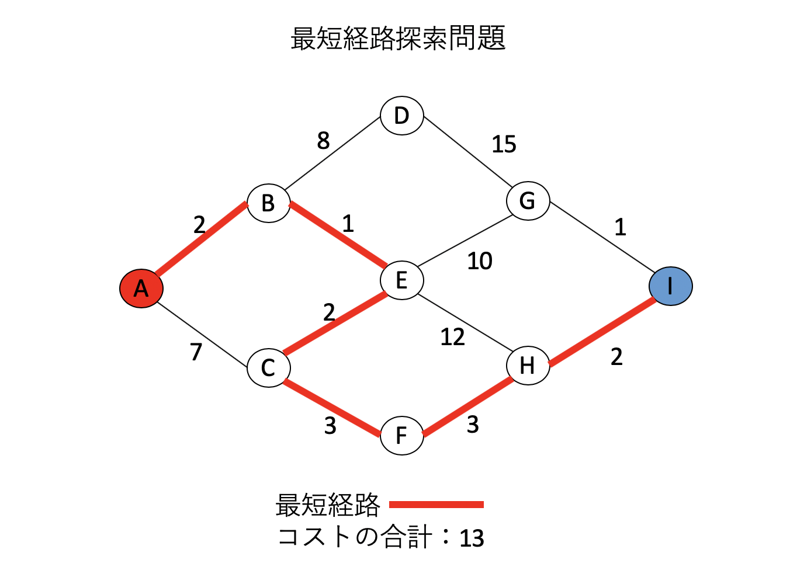

# [動的計画法](https://kaityo256.github.io/python_zero/dp/)

[[Up]](../index.html)
[[Repository]](https://github.com/kaityo256/python_zero)

## 本講で学ぶこと

* 組み合わせ最適化問題
* 動的計画法の要点
* 貪欲法
* メモ化再帰
* 漸化式とループ
* 余談：人外について

## 組み合わせ最適化問題

これまで、どこかで「ナップサック問題」という言葉は聞いたことがあるだろう。あなたは洞窟の奥で見事宝物庫を見つけた。そこには重さと価値がまちまちな「宝物」が多数あるが、持ち帰ることができる重さには上限がある。この時、決められた重さの中で価値を最大化するにはどうすればよいだろうか？というのがナップサック問題である。


このような「たくさんの物のセットが与えられ、何かの条件(ここでは重さの総和)を満たしつつ、何かの価値を最大化するような組み合わせを探す」という問題は、「組み合わせ最適化問題」と呼ばれる。ナップサック問題は典型的な組み合わせ最適化問題の一つである。

あまり意識していないかもしれないが、我々は日常的に組み合わせ最適化問題を解いている。例えばレストランでメニューを見ながら何を食べるか決める時、当然ながら美味しいものを食べたいと思うことであろう。しかし、美味しい物は一般に値段もカロリーも高いというのがこの世の摂理である。そこで、「ある程度の予算、カロリーの制限内で、一番幸せ度が高いメニューの組み合わせ」を探すことになる。これは典型的なナップサック問題である。

何か作業をする際、目の前にタスクが一つしかない、ということは少ないであろう。多くの場合、多数のタスクがそれぞれ依存関係を持っており、それらは最終的にはすべて片付けないといけないのだが、取り組む順番によってはコストが大きく変わる、ということもよくある。

例えばあなたは

* スーパーで食材の買い物をする
* 郵便局で封筒を簡易書留で出す
* 借りていた本を図書館に返しに行く

という三つのタスクをこなす必要がある。実行順序は自由だ。簡単のため、スーパー、図書館、郵便局は家から等距離にあるとしよう。どのような順番でタスクをこなすべきだろうか？

もし「スーパー」「郵便局」「図書館」という順序でタスクをこなすと、あなたは「重い本を持ちながらスーパーで買い物をして」「スーパーで購入した食材と本を持ちながら郵便局に行き」「最後に本を返す」ということになり、手が疲れてしまう。この場合は「図書館」「郵便局」「スーパー」の順番が良いだろう。まずは重い本をなんとかし、荷物が軽い状態で郵便局のタスクをこなし、最後に食材を買って帰れば、疲れは最小限で済む。

あなたは旅行を計画している。目的値に到着するのに、複数の経路があるのだが、できるだけ早く、もしくはできるだけ安く到着したい。どのような経路を取ればよいだろうか？いま、この経路をグラフで表現してみよう。


いま、A地点からI地点までいきたい。そのための経由地(例えば電車の駅だと思えばよい)がBからHまである。それぞれの地点間にはコストが定義されている。この場合のコストは時間もしくは料金である。

このように、我々は日常的に「何かの条件を満たしつつ、何かを最適化する」という問題に直面している。しかし、これらの問題の多くは「最適解」を得ることが難しい「NP困難 (NP-hard)」な問題であることが多い。「NP困難」については深く立ち入らないが、ようするに「最適解を得るには全ての組み合わせを調べるしかなく、要素数が増えると計算時間が爆発してしまう」という問題のことである。このような問題は、応用上は必ずしも厳密解を得る必要はなく、近似解が求まればそれで十分な場合も多いため、高速に近似解を求める手法も数多く提案されている。

しかし、ある種の組み合わせ問題は効率的に解くことができる。その際に使われる手法が本講で紹介する「動的計画法」である。

## 動的計画法の要件

「動的計画法」という、難しそうな名前がついているが、そのアルゴリズムの骨子はさして難しくない。動的計画法が適用できる条件は、以下の二つである。

* 大きな問題を、より小さな問題に分解できること (分割統治)
* 分解された小さな問題の結果が、再利用可能であること (メモ化)

例を挙げよう。先程の最短経路探索問題の回答は、以下のようなものだ。



A→B→E→C→F→H→I

この時、最短経路は13になる。さて、この経路をよく見てみよう。いま、最短経路がこのように定まったとしよう。AからEを経由してIに到達している。この時、「AからE」への経路も最短であり、「EからI」への経路も最短となっている。


このように、最短経路問題は「もし最短経路が求まったのなら、その途中の任意の二点間の経路も最短である」という性質をもっている。もしこの性質が満たされていないとしよう。例えば上記では、「AからE」の最短経路のコストは3であり、「EからI」の最短経路のコストは10、あわせて「AからI」へのコストは13となっている。もし「AからE」に、コスト2以下のパスがあるならば、そちらを採用すれば、「AからI」のコストを下げることができる。これは「AからIへの最短経路が求まった」という条件と矛盾する。以上から「最短経路の任意の二点間の経路も最短である」ことがわかる。


これがどのように問題を解くのに使えるか考えてみよう。いま知りたいのは「AからI」までの最短経路である。しかし、それより小さい問題、「AからG」までの最短経路と、「AからH」までの最短経路がわかっているものとしよう。それぞれ「A-G」のコストが13、「A-H」のコストが11である。すると、「GからI」のコストが1、「HからI」のコストが2であることがわかっているので、AからG経由でIに行く最短パスのコストは14、AからH経由でIに行くコストは13となり、A-H-Iの経路が最短であることがわかる。

こうして、「問題が部分的に解けている」ならば、それを「再利用」することでより大きな問題が解けるでしょう、というのが動的計画法の骨子である。

## サイゼリヤ問題

### サイゼリヤ問題とは

「レストランでどのメニューを頼むか悩む」のが、組み合わせ問題の一種であることを述べた。実際に最適化したいのは「幸せ度」であるが、「幸せ度」を定量化するのは難しいため、ここでは「一定の予算内で、摂取カロリーを最大化するメニュー」を探してみよう。ただし、同じメニューを重複して注文してはいけないことにする。

サイゼリヤのメニューは日々変わっているが、ここではある時点でのメニュー、114品の金額とカロリーのデータを使って、「サイゼリヤに1000円を握りしめていったら、最大何kcalを摂取できるか」という問題を解いてみよう。

### データの読み込み

まずはデータを読み込んでみよう。新しいノートブックを開き、いつも通り最初のセルで必要なものをimportする。

```py
import pickle
from collections import defaultdict
```

次に、データをロードしよう。二つ目のセルに以下を入力する。

```py
FILE='https://kaityo256.github.io/python_zero/samples/saizeriya/saizeriya.pickle'
!wget $FILE
```

最後に`‘saizeriya.pickle’ saved [5293/5293]`と表示されれば成功だ。これはpickleというライブラリでシリアライズされたデータである。読み込んでみよう。三つ目のセルに以下を入力せよ。

```py
with open('saizeriya.pickle', 'rb') as f:
    names, prices, cals = pickle.load(f)
```

これは、114種類のメニューそれぞれの、名前、価格、カロリー(kcal)のリストである。読み込めたら、4つ目のセルで、例えば`names`を評価してみよ。`「['彩りガーデンサラダ', '小エビのサラダ',,,'コーヒーゼリー','トリフアイスクリーム']`と表示されれば正しく読み込めている。確認できたら4つ目のセルは消しておくこと。

TODO: 貪欲法

TODO: メモ化再帰

TODO: 漸化式＋ループ

TODO: 解の最高性

## 余談：人外について

「人外」という言葉がある。「じんがい」と読む。同様に「人ではない」ということを意味する「非人」が侮蔑的な意味を持つことが多いのとは異なり、主にファンタジーなどの世界において、獣人や精霊、妖精など、人としての外見を持つが、基本的に人よりも高次の存在を「人外」と呼ぶことが多い。世界観にもよるが、基本的に「人外」は人間より優れた能力を持ち、通常の人間が敵う相手ではない、強大な存在として描かれることが多い。いつの頃からか、この「人外」という言葉が「同じ人間とは思えないような、卓越した成果を挙げている人間」を指すようになった。僕は、さらに意味が特化させ「同じ人とは思えないプログラム能力を持つ存在」として使っている。この意味での用例の初出がどこかはわからない。おそらく「競技プログラム」界隈から言われるようになったのではないかと思われる。

本稿の読者は大学生を想定しているが、20年近く生きていれば、「あ、こいつには絶対にかなわない」というような、才能の差を感じて絶望したことが一度や二度はあるであろう。おそらく君たちの二倍以上生きている筆者も、自慢じゃないがこれまでなんども「才能の差」に絶望してきた。特に「プログラミング」は、「できる人」と「できない人」の差が極めて大きく開く分野である。定義にもよるが、「できる人」と「できない人」の生産性はかるく桁で変わってしまう。そして、「この人、本当に人間なんかいな」という「人外プログラマ」の作るものを目の当たりにして驚嘆し、自分と比較して絶望し、その後に達観するのである。

我々一般人は、普通に生きていれば「人外」とぶつかる可能性は低い。むしろぶつからないように生きるのが正しい道である。しかし、何かとちくるって、一般人であるにもかかわらず「世界一になりたい」という野望を抱いてしまうと不幸である。なんでもよいが、何かの処理の最速、世界一を目指すと、極めて高確率で「人外」とぶつかる。人外は、その絶対数が少ない希少種である。しかし、何か数値化され、「世界一」が客観的に定義できる場所には(それがどんなにマイナーな分野であっても)必ず生息している。世界一になるためには、彼らに勝たなければいけない。ファンタジーでの定番、圧倒的な存在である人外をどうやって人間が討伐するか、という問題図式である。

ではどうすればいいのか？　まだどの分野でも世界一になったことがない僕は、もちろんその答えを持っていない。
