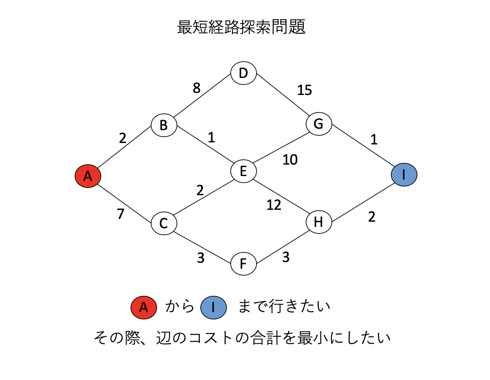
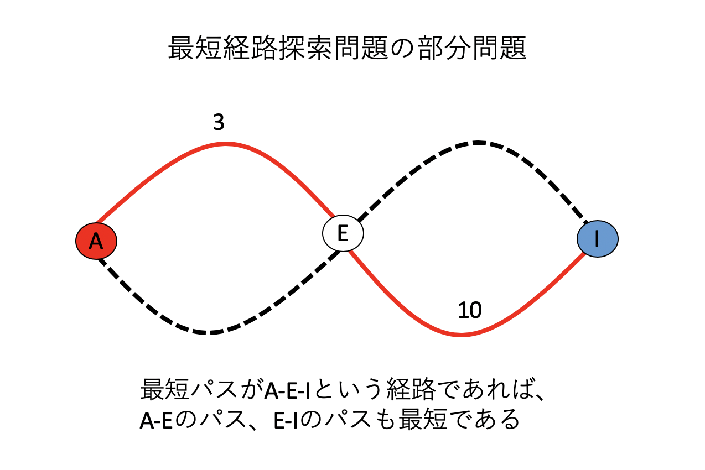

# [動的計画法](https://kaityo256.github.io/python_zero/dp/)

[[Up]](../index.html)
[[Repository]](https://github.com/kaityo256/python_zero)

## 本講で学ぶこと

* 計算量の概念
* 動的計画法
* 余談：人外について

## 動的計画法とは

動的計画法を知っているだろうか。英語ではDynamic Programmingというため、よくDPと略される。動的計画法を知らなくても、「ナップサック問題」は聞いたことがあるだろう。あなたは洞窟の奥で見事宝物庫を見つけた。そこには重さと価値がまちまちな「宝物」が多数あるが、持ち帰ることができる重さには上限がある。この時、決められた重さの中で価値を最大化するにはどうすればよいだろうか？というのがナップサック問題である。

このような「たくさんの物のセットが与えられ、何かの条件(ここでは重さの総和)を満たしつつ、何かの価値を最大化するような組み合わせを探す」という問題は、「組み合わせ最適化問題」と呼ばれる。ナップサック問題は典型的な組み合わせ最適化問題の一つである。

あまり意識していないかもしれないが、我々は日常的に組み合わせ最適化問題を解いている。例えばレストランでメニューを見ながら何を食べるか決める時、当然ながら美味しいものを食べたいと思うことであろう。しかし、美味しい物は一般に値段もカロリーも高いというのがこの世の摂理である。そこで、「ある程度の予算、カロリーの制限内で、一番幸せ度が高いメニューの組み合わせ」を探すことになる。これは典型的なナップサック問題である。

何か作業をする際、目の前にタスクが一つしかない、ということは少ないであろう。多くの場合、多数のタスクがそれぞれ依存関係を持っており、それらは最終的にはすべて片付けないといけないのだが、取り組む順番によってはコストが大きく変わる、ということもよくある。

例えばあなたは

* スーパーで食材の買い物をする
* 郵便局で封筒を簡易書留で出す
* 借りていた本を図書館に返しに行く

という三つのタスクをこなす必要がある。実行順序は自由だ。簡単のため、スーパー、図書館、郵便局は家から等距離にあるとしよう。どのような順番でタスクをこなすべきだろうか？

もし「スーパー」「郵便局」「図書館」という順序でタスクをこなすと、あなたは「重い本を持ちながらスーパーで買い物をして」「スーパーで購入した食材と本を持ちながら郵便局に行き」「最後に本を返す」ということになり、手が疲れてしまう。この場合は「図書館」「郵便局」「スーパー」の順番が良いだろう。まずは重い本をなんとかし、荷物が軽い状態で郵便局のタスクをこなし、最後に食材を買って帰れば、疲れは最小限で済む。

あなたは旅行を計画している。目的値に到着するのに、複数の経路があるのだが、できるだけ早く、もしくはできるだけ安く到着したい。どのような経路を取ればよいだろうか？いま、この経路をグラフで表現してみよう。

いま、A地点からI地点までいきたい。そのための経由地(例えば電車の駅だと思えばよい)がBからHまである。それぞれの地点間にはコストが定義されている。この場合のコストは時間もしくは料金である。

このように、我々は日常的に「何かの条件を満たしつつ、何かを最適化する」という問題に直面している。しかし、これらの問題の多くは「最適解」を得ることが難しい「NP困難 (NP-hard)」な問題であることが多い。「NP困難」については深く立ち入らないが、ようするに「最適解を得るには全ての組み合わせを調べるしかなく、要素数が増えると計算時間が爆発してしまう」という問題のことである。このような問題は、応用上は必ずしも厳密解を得る必要はなく、近似解が求まればそれで十分な場合も多いため、高速に近似解を求める手法も数多く提案されている。

しかし、ある種の組み合わせ問題は効率的に解くことができる。その際に使われる手法が本講で紹介する「動的計画法」である。

## 動的計画法の要件

「動的計画法」という、難しそうな名前がついているが、そのアルゴリズムの骨子はさして難しくない。動的計画法が適用できる条件は、以下の二つである。

* 大きな問題を、より小さな問題に分解できること (分割統治)
* 分解された小さな問題の結果が、再利用可能であること (メモ化)

例を挙げよう。先程の最短経路探索問題の回答は、以下のようなものだ。

A→B→E→C→F→H→I

この時、最短経路は13になる。さて、この経路をよく見てみよう。いま、最短経路がこのように定まったとしよう。AからEを経由してIに到達している。この時、「AからE」への経路も最短であり、「EからI」への経路も最短となっている。

このように、最短経路問題は「もし最短経路が求まったのなら、その途中の任意の二点間の経路も最短である」という性質をもっている。もしこの性質が満たされていないとしよう。例えば上記では、「AからE」の最短経路のコストは3であり、「EからI」の最短経路のコストは10、あわせて「AからI」へのコストは13となっている。もし「AからE」に、コスト2以下のパスがあるならば、そちらを採用すれば、「AからI」のコストを下げることができる。これは「AからIへの最短経路が求まった」という条件と矛盾する。以上から「最短経路の任意の二点間の経路も最短である」ことがわかる。

これがどのように問題を解くのに使えるか考えてみよう。いま知りたいのは「AからI」までの最短経路である。しかし、それより小さい問題、「AからG」までの最短経路と、「AからH」までの最短経路がわかっているものとしよう。それぞれ「A-G」のコストが13、「A-H」のコストが11である。すると、「GからI」のコストが1、「HからI」のコストが2であることがわかっているので、AからG経由でIに行く最短パスのコストは14、AからH経由でIに行くコストは13となり、A-H-Iの経路が最短であることがわかる。

こうして、「問題が部分的に解けている」ならば、それを「再利用」することでより大きな問題が解けるでしょう、というのが動的計画法の骨子である。

## サイゼリヤ問題

TODO: 貪欲法

TODO: メモ化再帰

TODO: 漸化式＋ループ

TODO: 解の最高性

## 余談：人外について

「人外」という言葉がある。「じんがい」と読む。もともとは「人ではないもの」という意味だが、私は「とても同じ人間とは思えないプログラマ」という意味で使っている。
