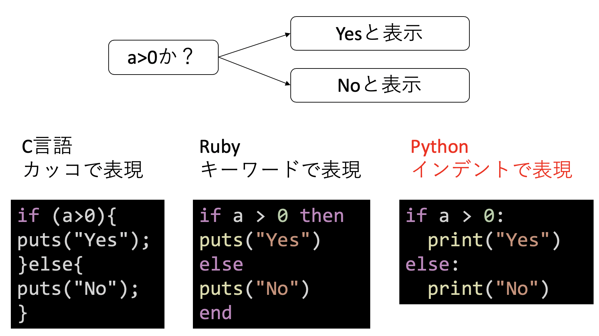
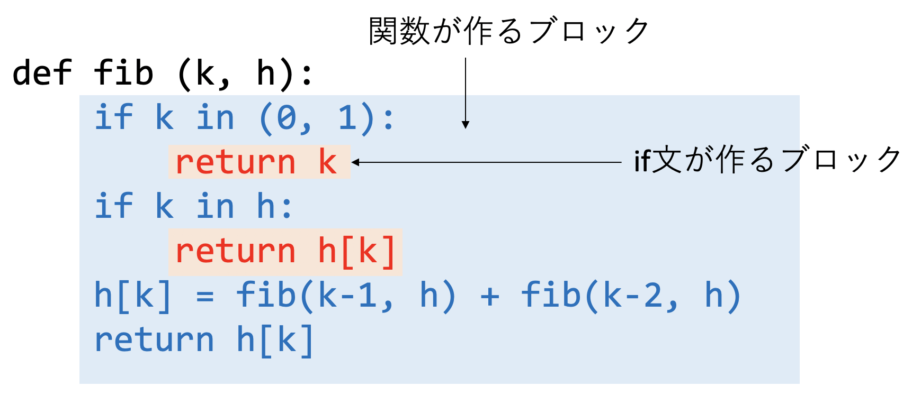
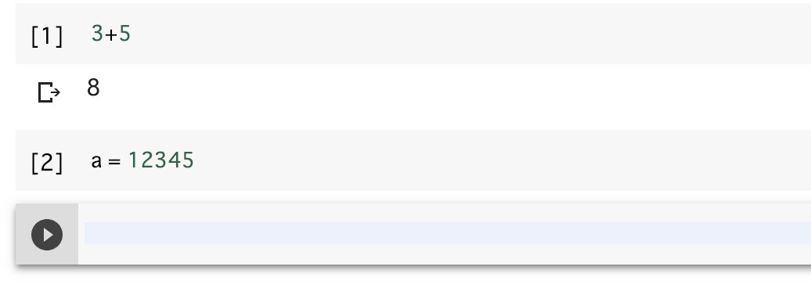
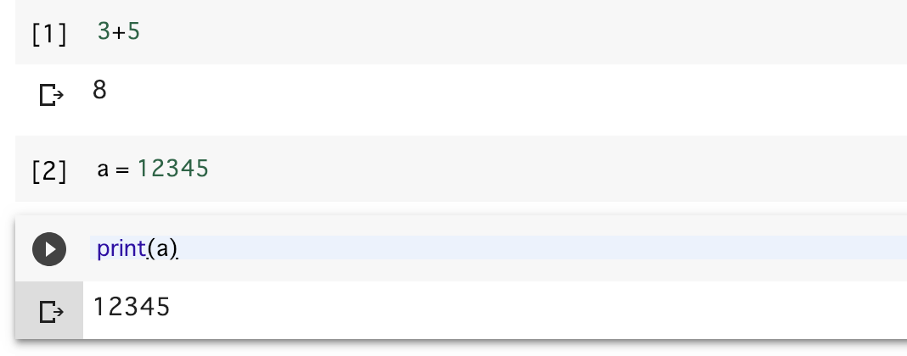

# Pythonの概要とGoogle Colabの使い方

## 本講の目的

* Pythonの概要を知る
* Google Colabの使い方を覚える
* Google Colabを通してPythonに触れてみる

## Pythonの特徴

### プログラミング言語について

Pythonとはプログラミング言語の一つである。プログラミング言語とは、人間がコンピュータに指示をするための言葉であり、非常に多くの種類がある。その中でもPythonは、昨今の機械学習ブームもあり、非常に人気のある言語の一つとなっている。ここでは、プログラミング言語とは何か、それがなぜ必要か、実際にプログラミング言語がどのように実行されているのか見てみよう。

コンピュータは「機械語(マシン語)」という言葉しか解さない。機械語は数字の羅列であり、昔はそれを人間が手で書いていたのだが、それは大変なので「もう少し人間からわかりやすい言葉から機械語に翻訳しよう」という試みが生まれた。これがプログラミング言語である。

この時、人間の書いたプログラムをその都度翻訳しながらコンピュータに教えるインタプリタ方式と、機械語に全て翻訳してから一気にコンピュータにわたすコンパイル方式があり、前者を「スクリプト言語」後者を「コンパイラ言語」と呼ぶ。ただし、両者の区別は絶対ではない。


### オフサイドルールについて

プログラムは、いくつかの「文(statement)」でできている。「文」とはプログラム実行の単位である。プログラムは「文」が並んだものとして構成される。プログラムは原則として「上から順番に」実行されていく。しかし、例えば条件分岐などで「AならばXを、そうでなければYを実行したい」ということがあるだろう。この時、なんらかの方法で「X」や「Y」といった「かたまり」を表現しなければならない。いくつかの文で表現された「かたまり」を「コードブロック (code block)」あるいは単に「ブロック」と呼ぶ。このブロックをどのように表現するかが、プログラミング言語の見た目を決める。Pythonはブロックをインデントによって表現するのが大きな特徴である。これをオフサイドルールと呼ぶ。コードブロックの表現方法としては、他に中括弧方式や
キーワード方式がある。



中括弧方式は、C言語、及びC言語に影響を受けた言語が採用している方法であり、コードブロックを`{}`で囲んで表現する。例えば「`a`が正ならYes、そうでなければNoを表示する」プログラムなら

```c
if (a > 0){
  puts("Yes");
}else{
  puts("No");
}
```

と表現する。C、C++、Java、C#などのコンパイル言語や、JavaScriptやPerl、PHPといったスクリプト言語など、多くの言語がこの中括弧方式を採用している。

キーワード方式は、例えば`begin`や`do`、`end`といった、あらかじめ決められた言葉(予約語と呼ぶ)によってブロックを表現する方法である。例えばRubyなら

```rb
if a > 0 then
  puts("Yes")
else
  puts("No")
end
```

と書ける。ここでは`then`、`else`、`end`で囲まれた部分がコードブロックである(この例では`then`は省略可能)。

この方式の最初の採用例はおそらくALGOLだと思われる。Rubyの他にはBASICやシェルスクリプト、Pascalなどがキーワード方式を採用している。

先程二つの例では、コードブロックの中の文頭にいくつか空白が入っていた。これは「インデント (indent)」と呼ばれ、特にブロックがネストした場合にコードブロックを見やすくするための工夫である。多くの言語では空白は無視される。C言語は改行も無視される(空白とみなされる)ため、

```c
if (a > 0){puts("Yes");}else{puts("No");}
```

と書いても同じ意味である。これでは見づらいため、適宜改行やインデントを入れてプログラムを見やすくすることがよく行われていた。

しかし、Pythonはコードブロックをインデントで表現するため、空白にプログラム上の意味がある。先程のプログラムをPythonで書くと以下のようになる。

```py
if a > 0:
    print("Yes")
else:
    print("No")
```

Pythonではこのように、「キーワード + コロン(:)」でブロックが始まり、続くブロックはインデントで表現される。インデントは同じ高さなら空白何文字でも、タブ文字でも良いが、同じブロックに含まれる文のインデントが異なるとエラーとなる。

```py
print("Hello")
  print("Python") # ←ここで「IndentationError: unexpected indent」というエラーになる
```

このように、インデントでブロックを表現する方法を「オフサイドルール (off-side rule)」と呼ぶ。このオフサイドルールを採用していることがPythonの大きな特徴である。

コードブロックはネストすることがあるが、その度にインデントが深くなる。例えば以下はメモ化したフィボナッチ数の計算ルーチンである。



関数が作るブロックの中に、if文が作るブロックがネストしており、その文だけインデントが深くなっている。

### Pythonの哲学とコーディングスタイル

Pythonに限らず、どのプログラミング言語にも、開発者の設計思想が強く表れる。Pythonの哲学は、例えば[The Zen of Python](https://www.python.org/dev/peps/pep-0020/)にまとまっている。全部で19あるが、そのうちいくつかを引用してみよう(和訳は筆者による)。

> Beautiful is better than ugly.
> 美しいことはよいことだ。
>
> Simple is better than complex.
> 単純であることはよいことだ。
>
> Complex is better than complicated.
> しかし、ややこしいよりは複雑であるほうが良い。
>
> Flat is better than nested.
> ネストは浅い方が良い。
>
> Readability counts.
> 読みやすさが正義。
>
> Special cases aren't special enough to break the rules.
> 特別な場合を許さない。
>
> Although practicality beats purity.
> 純粋さよりは実用を重視せよ。
>
> Now is better than never.
> 「いつか」より「今」
>
> Although never is often better than *right* now.
> しかし、あわてて今やるよりはやらない方が良いこともある。

この文章はPython Enhancement Proposals、通称PEPの20番として登録されたものだ。PEPとはPython開発コミュニティやユーザが参照するドキュメントのことで、様々な種類があり、多くのドキュメントが登録されているが、よく参照されるのが「Pythonのコーディング規約」を定めた[PEP8](https://www.python.org/dev/peps/pep-0008/)である。コーディング規約とは、コードを書く際の決まりごと、いわばマナーである。Pythonを貫く哲学の一つに、「誰が書いても同じようになるべし」というものがある。PEP8に従って書くことで、例えば「人によってインデントの深さや変数名の付け方が異なるので、大きなプロジェクトで流儀が混ざって読みづらくなる」といったことを防ぐことができる。また、バグの発生源となりやすい表記方法を禁止することで、バグの混入を防ぐ、という目的もある。

PEP8は実に多くのルールを定めている。その多くは、「処理内容は変わらないが、より好ましい書き方を推奨する」というものだ。例えばある変数が真である時に何かを処理したい場合、

```py
if a == True:
    print("True")
```

と書くより、

```py
if a:
    print("True")
```

と書きましょう、といった具合だ。他にも「インデントは空白4文字」「空白の入れ方」「改行の入れ方」など、様々な細かい「マナー」が書いてある。

本講義ではとりあえずこの「マナー」は気にしなくて良いが、実際にPythonを使ってコードを書いたり、それを外部に公開したりする場合は気にした方がよいだろう。Pythonには、コードがPEP8に従っているかチェックしてくれる`pep8`というツールや、コーディングスタイルだけではなく品質チェックもする`pylint`といったツールがある。広く使われているエディタはほとんどこういったツールとの連携機能があるので、それらを有効にするだけで自動的にコーディングスタイルを守れるようになるはずだ。

## Google Colabの使い方

本講義では、Google Colaboratory、略してGoogle Colab(グーグル・コラボ)を使ってPythonを学ぶ。Google ColabはGoogleによるクラウドに用意されたJupyterノートブーク環境であり、ブラウザさえあればPythonが実行できる。この環境が完全に無料で使えるというのだから恐れ入る。まずはGoogle Colabの簡単な使い方を学ぼう。以下、Googleアカウントは持っているものと仮定する。

まず、Googleにログインした状態で、[Google Colabのウェブサイト](https://colab.research.google.com)にアクセスする。Googleアカウントの優先言語が日本語になっていれば日本語で表示されると思うが、もし英語で表示されたら、アカウント設定で日本語に設定する。稀に日本語に設定してもGoogle ColabやGoogle Driveのメニューが日本語にならない場合がある。その際は一度、英語などの別の言語に設定してから日本語に戻すとうまく設定されるようだ。

正しくアクセスできると、以下のようなウェルカムメニューが表示される。


ここで「PYTHON 3の新しいノートブック」をクリックしよう。Untitled0.ipynbという名前のファイルが作成され、入力待ちとなる。


この三角の矢印のある行に、なにか入力してみよう。たとえば「3+5」と入力し、「三角ボタンをクリック」するか、「シフトキーを押しながらリターン」を入力する。以下、この動作を「実行する」と呼ぶ。


矢印がしばらくくるくる回ってから、\[1\]という表記に変わり、答えである8が表示されたと思う。これは

* 「3+5」というPythonのコードがクラウドに送信され
* クラウドでPythonが実行され
* その結果である8が表示された

ということが起きている。

Jupyterノートブックは、「セル」と呼ばれる単位で編集を行う。先程入力した「3+5」と、結果の「8」がまとめて一つのセルである。実行後、新たな「セル」が作られ、入力待ちになっている。そこに「a = 12345」と入力して、また実行してみよう。



こんどは何も実行結果が出力されない。これは「aという変数を作成し、そこに12345という値を代入せよ」という意味だ。これにより「a」という変数に「12345」という整数の値が記憶されている。これを表示してみよう。次のセルに「print(a)」と入力して実行せよ。



「12345」という表示が得られたはずである。変数の値を表示するだけなら、「print」は不要である。左上の「+ コード」と書かれたところをクリックし、出てきたセルに「a」とだけ入力して実行せよ。やはり「12345」という表示が得られたはずである。

さて、ここまでで5つのセルができたはずである。これらは自由に編集、再実行することができる。\[2\]の「a=12345」を修正し、「a=6789」として実行してみよう。その後、4番の「print(a)」や5番の「a」のセルを実行し、出力が変わることを確認せよ。

不要なセルは削除することができる。セルの右側のメニューから「セルの削除」を選ぶとセルが削除できる。また、上段のメニューの「↑ セル」や「↓ セル」で、セルの順番を入れ替えることもできる。

## Pythonの概要とGoogle Colabの使い方：課題

### 課題1：Google Colabを使う

まず、Google Colabへのログインと簡単なプログラムの実行、セルの編集のテストをする。

#### 課題1-1：Google Colabへのログイン

`https://colab.research.google.com/`にアクセスし、右上に表示された「ログイン」ボタンを押してログインせよ。

#### 課題1-2：プログラムの動作テスト

最初のセルに、以下のプログラムを入力し、実行せよ。

```py
print("Hello World!")
```

セルの左にある再生ボタンを押すか、セル内で「シフト+エンターキー」を押すことでそのセルを実行できる。

#### 課題1-3：プログラムの失敗テスト

「＋コード」を押して、2つ目のセルを表示させ、 以下のプログラムを入力し、実行せよ。わざと`print`を`plint`と間違って記載している。

```py
plint("Hello World!")
```

実行し、`NameError`が出ることを確認したら、`plint`を`print`と修正して、同じセルを再度実行し、正しく実行されることを確認せよ。

#### 課題1-4：セルの移動、削除

二つ目のセルを一番上に移動させた後、そのセルを削除せよ。

#### 課題1-5：ファイル名の指定

このノートブックに`hello.ipynb`という名前をつけて保存せよ。保存されたファイルはGoogleドライブに保存される。興味があれば「ファイル」メニューから「ドライブで探す」をクリックして見てみよ。

### 課題2: 描画プログラム

#### 課題2-1：描画の確認

Google Colab上で、簡単な描画プログラムを作成、実行してみよう。現在開いているノートを閉じて、新たにノートブックを作成する。
「ファイル」メニューから「PYTHON3の新しいノートブック」をクリックせよ。新しいノートブックが開かれたら`draw.ipynb`という名前に変更せよ。

以下、番号はセルの順番を表している。

##### 1. ライブラリのインポート

最初のセルに以下のプログラムを書いて実行せよ。

```py
from PIL import Image, ImageDraw
```

これは、イメージ描画ライブラリを利用するよ、という宣言である。`import`文については後で学ぶので、今は気にしなくて良い。

##### 2. 描画

```py
img = Image.new("L", (256, 256), 255)
draw = ImageDraw.Draw(img)
cx = 128
cy = 128
r = 96
draw.ellipse((cx - r, cy - r, cx + r, cy + r))
```

`draw.ellipse`は、指定された二つの座標を左上と右下とする長方形に接する楕円を描く命令である。今回は正方形を入力しているので円を描く命令となっている。正しく入力されていればエラーは出ないはずだが、エラーが出たら、実行してエラーがでなくなるまで修正、実行を繰り返そう。

##### 3. イメージの表示

３つ目のセルに以下を入力し、実行せよ。

```py
img
```

これまで正しく入力していれば、白地に黒い線で円が表示されたはずである。エラーが出たり、うまく表示されなかったら、入力したセルの内容を見直そう。

#### 課題2-2：五芒星の描画

Jupyterノートブックは、すでに入力済みのセルを修正することができる。

##### 1. インポートの追加

一番目のセルを以下のように修正し、実行せよ。

```py
from PIL import Image, ImageDraw
from math import pi, sin, cos # この行を追加
```

コメントの`# この行を追加`という文章は入力しなくて良い。

三行目に、`math`ライブラリから円周率、sin、cos関数を使うよ、という宣言を追加した。

##### 2. 五芒星の描画

二番目のセルの円を描く命令の直後に、以下のようにプログラムを追加しよう。

```py
im = Image.new("L", (256, 256), 255)
draw = ImageDraw.Draw(im)
cx = 128
cy = 128
r = 96
draw.ellipse((cx - r, cy - r, cx + r, cy + r))
# ↓ここから追加 (このコメントは入力しなくて良い)
N = 5
s = 2*pi/N
k = N // 2
for i in range(N):
  s1 = ((i*k)%N)*s - 0.5*pi
  s2 = s1 + s*k
  x1 = r*cos(s1)+cx
  y1 = r*sin(s1)+cy
  x2 = r*cos(s2)+cx
  y2 = r*sin(s2)+cy
  draw.line((x1,y1,x2,y2))
```

`for i in range(N):`の行を入力して改行すると、カーソルの位置が少し右にずれたはずである(行末のコロンを忘れないこと)。これを **インデント** と呼ぶ。インデントは、プログラムの階層構造を視覚的に表現するのに使われる工夫であったが、Pythonはそれを言語仕様として取り込んだ。`for i in range(N):`以下はすべて同じインデントのレベルに記載すること。そのまま入力していけば正しいインデントになるが、もしずれた場合には、一度左の空白をすべて消してからタブキーを一度押せば正しいインデントになる。

二つ目のセルの入力が終わったら実行してみよう。この時点ではまだ何も表示されない。

##### 3. イメージの表示

さて、一つめのセルの`import`文、二つめのセルの描画プログラムが完成し、それぞれ正しく実行できたら、最後に三つ目のセル

```python
img
```

を実行してみよう。こちらは修正しないでそのまま再実行すれば良い。実行するには、三つ目のセルの三角マークをクリックをクリックするか、クリックしてフォーカスを移してからシフト+リターンを入力すれば良い。正しく実行できていれば、「黒字に白い丸」のイメージに、五芒星が表示されたはずである。

#### 課題2-3：N芒星の描画

先の二つめのセルの`N = 5`の値を7や9に変えて実行してみよ。51などと大きな値にするとどうなるだろう？また、このプログラムは`N`が偶数の時にはうまく描画できない。プログラムの動作原理を推測し、なぜ偶数で動かないのか考えてみよ。

#### 発展課題

先のプログラムを`N = 6`のときに六芒星が描かれるように修正せよ。ヒント：三角形をずらして二つ描画せよ。

## 余談：タッチタイピングについて

今後どうなるかはわからないが、少なくとも現時点において最速の情報入力デバイスはキーボードであろう。今後もしばらく重要な入力インターフェースとしてキーボードが使われる見込みである。さて、キーボードを使って情報を入力するためには、指でキーを叩かなければならない。この時、キーボードを見ないでキーを叩くことを「タッチタイピング」と呼ぶ。この講義を受けている人で、もしまだタッチタイピングができない人がいたら、絶対にマスターしたほうが良い。よく誤解されるが、タッチタイピングは「キーをすばやく叩く」ためのものではない。もちろんキー入力は早いに越したことはないが、それより重要な役目は **キー入力で肩が凝らないようにする** ことである。今後、どのような職業につくにせよ、その多くはパソコンを使った作業を伴うであろう。この時、正しくない姿勢で打鍵したり、ディスプレイとキーボードの間を忙しく視線移動しながら打鍵していると、そのうちひどい肩凝りに悩まされるようになる。肩凝りに悩まされながら知的作業を行うのはかなり困難である。キーボードの「F」と「J」のキーを見よ。小さな突起があり、手で触ってわかるようになっているであろう。左右の人差し指を「F」と「J」のキーに置くことを「ホームポジション」という。そこから様々なキーを「見ないで」打鍵するのがタッチタイピングである。早く打鍵するのではなく、ゆっくり正確に、手の重さを机に逃がすことを意識しながら打鍵するように心がけよう。一週間も練習すればタッチタイピングできるようになり、一生その恩恵を受けることができる。タッチタイピングは絶対にマスターする価値がある技術の一つである。
