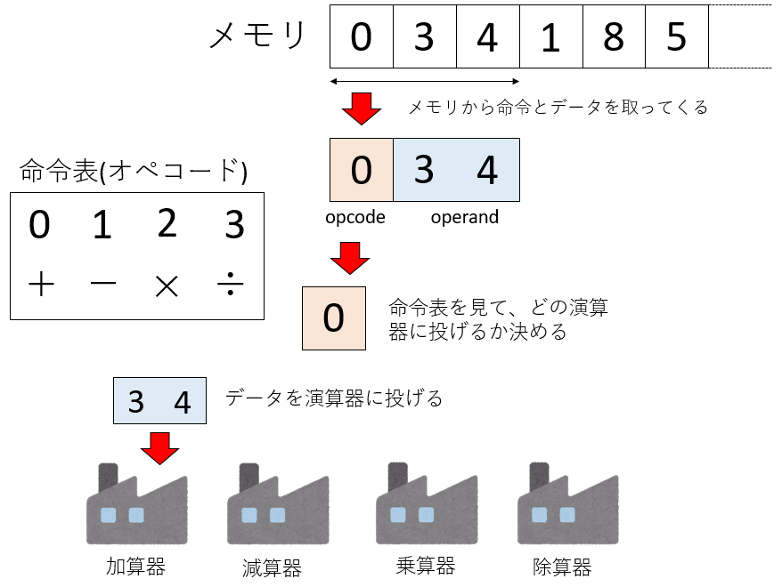
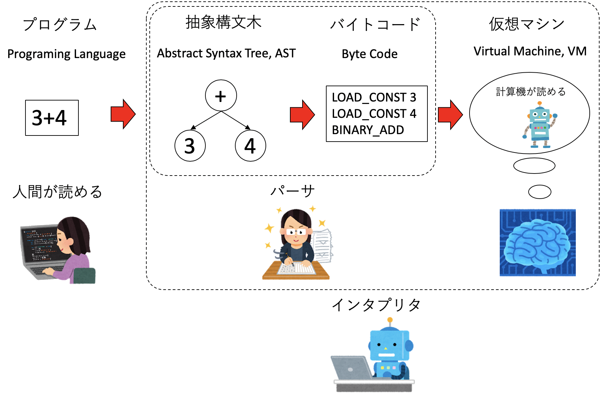

# [Pythonはどうやって動くのか](https://kaityo256.github.io/python_zero/howtowork/)

* コンピュータはどうやって動くのか
* プログラム言語とは
* Pythonが動く仕組み1: 抽象構文木
* Pythonが動く仕組み2: バイトコードと仮想マシン
* 仮想マシンハック(やるんですか？)抽象構文木をいじる程度にするかな。

## コンピュータはどうやって動くのか

車を運転していない人でも、車はガソリンという可燃性の液体を燃料とし、それを噴射して点火、爆発させてピストンを動かし、そのピストンの運動を回転運動に変換してタイヤに伝えて動いている、ということはぼんやりと知っていることだろう。この知識は、車を運転するときにはあまり必要ない。実際、車の運転をする際にエンジンやトランスミッションの仕組みを意識することは(よほど車好きでない限り)稀であろう。しかしそれでも、車の仕組みは簡単に知っておくべきだと思う。冷蔵庫や電子レンジ、これらの家電は、その動作原理を知らずとも使うことは可能だし、おぼろげに原理を知っているからといってあまり役に立つ気はしないが、やはりざっくりとは知っておくべきだと思う。それが教養というものだ。コンピュータの動作についても同様である。

これまで、ブラウザ上でプログラムを入力し、実行させ、その結果を表示させてきた。Pythonのプログラムはクラウド上で実行されたが、そのブラウザを実行しているのは皆さんの目の前にあるのはコンピュータである。コンピュータとはcomputeするもの、つまり計算機であり、何かしら計算してその結果を表示することを繰り返す機械である。では、そもそもプログラムとはどうやって動いているのだろうか？せっかくプログラミングを覚えるのだから、計算機がどういう仕組みで動いているのか知っておいた方が良いだろう。なお、私は古い人間なので、コンピュータのことをどうしても「計算機」と呼んでしまう。以後、パソコンやCPUなどを指して「計算機」と呼ぶのでそのつもりでいて欲しい。

いま、目の前にある計算機は、ディスプレイ(表示装置)、キーボードやマウス(入力装置)、CPU(中央演算処理装置)、メモリ(記憶装置)などから構成されている。ディスクなどのストレージやネットワークなどの通信装置については今は忘れよう。このうちCPUがもっとも重要な装置であるが、やっていることは非常に単純で、

* メモリから命令とデータを取ってくる
* 命令を解釈し、データを演算器に投げる
* 演算器から返ってきた結果をメモリに書き戻す

ということをひたすら繰り返しているに過ぎない。「命令」も一種のデータであり、メモリに置いてあることに注意しよう。演算器というのは、文字通り演算する機械である。例えば足し算をしたければ加算器を、掛け算をしたければ乗算器が必要になる。また、整数演算と浮動小数点演算は全く異なる演算器を用いる。

さて、計算機が解釈できるのは数字だけである。したがって、人間が計算機に命令するためには、機械語(マシン語)と呼ばれる数字の羅列を使う必要がある。コンピュータとは計算機であり、計算とはデータに四則演算などの演算をすることである。したがって、計算機に何か計算させたければ「何を(データ)」「どうするか(命令)」がセットである必要があることがわかるだろう。機械語というと難しそうだが、結局のところ「何を」「どうするか」を羅列しているに過ぎない。



例えば一桁の整数を二つ受け取って四則演算をする計算機があったとしよう。四則演算をするので、演算は加算、減算、乗算、除算の四種類である。なのでそれぞれに0,1,2,3の数字を割り当てよう。四則演算をするには、整数が二つ必要だ。その数字も並べよう。例えば「034」という数字列は「3+4」を、「185」は「8-5」を表す。計算機は、メモリから三つの数字をとってきて、最初の数字を見て「どの演算器に投げるか」を決める(命令を最初に置いたのはそのためだ)。そして続く二つのデータを演算器に投げる。かなり単純化されているが、これが機械語である。このように、「何をするか」を表す部分をオペコード(operation code, opcode)、「データ」を表す部分をオペランド(operand、被演算子)と呼ぶ。

## プログラム言語とコンパイラ

さて、計算機が解釈できるのは機械語だけである。機械語は難しくはないが、「足し算は0で・・・」と覚えるのは面倒だ。そこで「034」という数字の羅列の代わりに「ADD 3,4」という書き方をしよう。これを「034」に変換するのは簡単だし、人間が見て「3と4を足すんだな」とわかりやすい。このように機械語と一対一対応する言語を「アセンブリ言語(Assembly Language)」と呼ぶ。しかし、アセンブリ言語でもまだ面倒だ。もっと、人間にわかりやすい形式、先ほどの例なら「3+4」と書いて、それを計算機が理解できる形式に変換したい、と思うのは自然であろう。その「人間が理解できる形式」がプログラム言語と呼ばれるものである。

プログラム言語は人間にわかりやすい形式になっているが、そのままでは機械は理解できない。そこで、プログラムを機械語に「翻訳する」必要がでてくる。この翻訳作業をするのがコンパイラである。

一口に「翻訳」と言っても、コンパイラがやるべき仕事は多い。まず「3 + 4」というひと続きの文字列が与えられたときに、「3」「+」「4」という文字に分割しなければならない。これを**字句解析**と呼ぶ。さらに、「3と4は整数であり、+という演算子の引数である」と認識する必要がある。これが**構文解析**と**意味解析**である。この構文解析を行うのがパーサ(parser, 構文解析器)である。パーサは、プログラムを「抽象構文木 (Abstract Syntax Tree, AST)」と呼ばれるデータ構造に変換する。


パーサによって抽象構文木が与えられたら、そこからアセンブリコードを生成する。通常は途中で中間コードを生成し、その後にアセンブリ言語に変換する。アセンブリを実行ファイルにするためには、さらに「リンク」という作業工程がある。リンクを行うのがリンカ(Linker)というプログラムで、これもかなり複雑なことをしているのだが、本講義では扱わない。

最初に、プログラム言語には大きく分けてコンパイル言語とインタプリタの二種類があることに触れた。プログラムをコンパイラが機械語に翻訳し、そのまま実行するのがコンパイル言語であり、C++などはコンパイル言語の代表格的な言語である。

一方、プログラム言語を逐次的に解釈して実行するのがスクリプト言語であり、Pythonもインタプリタ言語に属す。しかし、プログラムをそのまま解釈しながら実行すると遅いため、多くのスクリプト言語は「バイトコード」と呼ばれる中間コードを生成し、それを実行することで高速化を図る。



Pythonは、まずプログラムを抽象構文木に変換する。その後、その構文木からバイトコードを生成する。バイトコードは仮想的な機械語である。機械語は、現実に存在する機械で動作するが、バイトコードは仮想的な機械向けの機械語である。このバイトコードを実行するプログラムを**仮想マシン(Virtual Machine, VM)**と呼ぶ。「エミュレータ」という言葉を聞いたことがあるかもしれない。昔のゲームハード用のゲームを、現在のゲームで実行するのに使われたりする。仮想マシンは、実際には存在しないハードウェアであるが、それを現実の計算機でエミュレートすることでプログラムを実行する。

本講ではPythonが動く仕組みを理解するため、実際に抽象構文木とバイトコードを見てみることにしよう。

## バイトコードとスタックマシン

プログラムを抽象構文木に変換したら、それを仮想マシン用のバイトコードに変換する必要がある。

TODO: スタックマシンの話

TODO: 中置記法、逆ポーランド記法の説明

TOOD: Pythonバイトコードが逆ポーランド記法になっていることを確認

以下の違いを見せる。

```py
dis.dis("a + b * c")
dis.dis("a * b + c")
```

# Pythonはどうやって動くのか：課題

## 課題1：抽象構文木

### 課題1-1：抽象構文木の可視化

Pythonのプログラムが抽象構文木に変換される様子を観察してみよう。新しいノートブックを開き、以下のプログラムを4つのセルに分けて入力せよ。

#### 1. ライブラリのインポート

```py
import ast
from IPython.display import Image, display_png
from graphviz import Digraph
```

#### 2. 抽象構文木をグラフに変換する関数

抽象構文木を解析してグラフに変換する関数`visit`を書く。

```py
def visit(node, nodes, pindex, g):
    name = str(type(node).__name__)
    index = len(nodes)
    nodes.append(index)
    g.node(str(index), name)
    if index != pindex:
        g.edge(str(index), str(pindex))
    for n in ast.iter_child_nodes(node):
        visit(n, nodes, index, g)
```

TODO: オペランドの値も表示させるか？

#### 3. グラフを可視化する関数

抽象構文木をグラフとして可視化する関数`show_ast`を書く。

```py
def show_ast(src):
    graph = Digraph(format="png")
    tree = ast.parse(src)
    visit(tree, [], 0, graph)
    graph.render("test")
    display_png(Image("test.png"))
```

#### 4. 抽象構文木の表示

ここまで作成した関数を使って、プログラムの抽象構文木を表示させて見よう。解析したいソースコードを`src`という文字列に代入し、`show_ast(src)`を呼ぶことで抽象構文木を表示することができる。

```py
src="""
3+4
"""
show_ast(src)
```

ここまで正しく入力されていれば、4つ目のセルを入力、実行したところで、抽象構文木のグラフが表示されるはずである。

`ast.parse`は、引数として与えられた文字列をPythonのプログラムとして解釈し、抽象構文木に変換する。返り値は、構文木の根(root)である。それを`ast.iter_child_nodes`に渡すと、そこにぶら下がるノードが返ってくるので、それらすべてに対してfor文をまわして、子ノードに対して再帰的にまたその子ノードを取得する、というのがこのコードの仕組みである。

### 課題1-2：様々なプログラムのパース

4つ目の(入力するプログラムを与えるセル)の文字列を変え、別のプログラムをパースしてみよ。まずは`+`を`-`や`/`、`//`に変えてみよ。次に、以下のプログラムをパースせよ。

```py
a, b = (1,2)
```

```py
def func(a,b):
    return a+b
```

```py
for i in [1,2,3]:
    print(i)
```

上記のプログラムを入力するには、`"""`で囲まれた領域に入力すること。例えば最初の例なら、

```py
src = """
a, b = (1,2)
"""
```

と入力する。何が作られて、何にアサインされているだろうか？

## 課題2：バイトコードの可視化

## 課題3：スタックマシンの実装

Pythonは、まずプログラムがバイトコードと呼ばれる(アセンブリに似た)中間言語にコンパイルされ、それが仮想マシン上で実行される。Pythonをはじめとして、多くの仮想マシンが「スタックマシン」という形式を取る。スタックマシンとは、データをスタックを通じてやりとりする方式の機械のことだ。ここでは、最も簡単なスタックマシンの例として、計算機を実装してみよう。

### 課題3-1: 逆ポーランド記法電卓

逆ポーランド記法で記述された計算式を評価する計算機を作りたい。逆ポーランド記法とは、「3+4」を「3 4 +」と表記する方式だ。人間には読みづらいが、電卓を実装しやすい、という特徴がある。

具体的には、以下のような「プログラム」を組む。

* プログラムは、整数、'+'、`-'の三種類の**トークン**で構成される
* プログラムを一つ読み込み、以下の動作をする
  * プログラムが演算子なら、スタックから二つデータをポップして、計算し、結果をプッシュする
  * 整数なら、そのままスタックにプッシュする
* プログラム終了時、スタックの一番上にある数字を表示して終了する

#### 1. 計算機の実装

新しいノートブックを開き、最初のセルに以下を入力せよ。これは、逆ポーランド記法で記述された「プログラム」を実行する仮想マシンである。

```py
def calc(code):
    data = code.split()
    stack = []
    for x in data:
        print(stack, x, end=" => ")
        if x == '+':
            b = stack.pop()
            a = stack.pop()
            stack.append(a+b)
        elif x == '-':
            b = stack.pop()
            a = stack.pop()
            stack.append(a-b)
        else:
            stack.append(int(x))
        print(stack)
    print(stack.pop())
```

#### 2. 計算のテスト

実際に計算してみよう。2つ目のセルで以下を実行せよ。

```py
calc("1 2 +")
```

以下のような実行結果が得られたはずである。

```txt
[] 1 => [1]
[1] 2 => [1, 2]
[1, 2] + => [3]
3
```

これは、

* 最初はスタックが空`[]`で、そこに`1`が来たのでプッシュされて`[1]`になった
* 次に`2`が来たので、それもプッシュしてスタックの状態が`[1,2]`になった
* 次に`+`が来たので、スタックから値を二つ取り出し、その和をプッシュして`[3]`になった
* 実行すべきプログラムがなくなったので、スタックの一番上にある数字`3`を表示して終了

という順番で実行されている。

### 課題3-2: 乗算、除算の実装

作成した電卓に、乗算と除算を実装せよ。ただし、除算に関しては、「プログラム」としては`\`を入力するが、実際には`\\`を実行することで、実行結果を整数にすること。

以下の「プログラム」に対して、以下のような実行結果が得られれば正しく実装できている。

```py
calc("1 2 + 3 * 4 /")
```

```txt
[] 1 => [1]
[1] 2 => [1, 2]
[1, 2] + => [3]
[3] 3 => [3, 3]
[3, 3] * => [9]
[9] 4 => [9, 4]
[9, 4] / => [2]
2
```

### 課題3-3: 複雑な計算

以下の中置記法の計算式を、逆ポーランド記法に「頭で」変換し、先程の計算で実行せよ。演算子の優先順位も考慮すること。

* `3 + 4 + 5`
* `3 + 4 * 5`
* `3 + 4 * 5 - 12`
* `(1 + 4 * 5) / 7`

### 任意課題

中置記法の計算式を、逆ポーランド記法に変換するコードを作成せよ。括弧は実装しなくてよいが、乗算や除算は加減算より優先されなくてはならない。例えば、

* `1 + 2 * 3`

という入力が与えられたら、

* `1 2 3 * +`

という文字列を出力しなければならない。

実装のヒント：

バッファとスタックを用意する。

* プログラムから一つトークンを取り出す
* もしトークンが数字ならバッファにプッシュする
* もしトークンが`*`か`/`ならスタックにプッシュする
* もしトークンが`+`か`-`なら、スタックが空になるか、スタックの最上位が`+`もしくは`-`になるまで、「スタックからポップしてバッファにプッシュする」を繰り返す
* プログラムからすべてトークンを取りだしたら、スタックが空になるまで「スタックからポップしてバッファにプッシュする」を繰り返す

以上を実装すると、バッファに逆ポーランド記法の順序でトークンが並ぶので、`" ".join(buffer)`を実行すれば所望の文字列を得る。

## 余談：スクリプト言語とコンパイラ言語

Pythonはスクリプト言語、C++はコンパイラ言語に分類するのが一般的だが、「スクリプト言語」と「コンパイラ言語」の区別は絶対ではない。本講で学んだように、ほとんどのスクリプト言語は一度「中間コード」と呼ばれる言語に「コンパイル」され、中間コードを仮想マシン上で動かすことで動作の高速化を図っている。また、Javaはプログラムをコンパイルしてから実行する形式のためにユーザからは「コンパイル言語」のように見えるが、実際にはPythonと同様にプログラムを中間コードに変換し、それを「Java 仮想マシン (JVM)」上で動作させている。Java仮想マシンは中間コードを実行する際に、インタプリタのように実行する場合と、部分的に機械語に変換しながら実行する場合(JIT方式と呼ばれる)がある。さらに、Javaのプログラムをそのまま機械語に変換する処理系もある。

また、C言語やC++言語は通常「コンパイラ言語」に分類され、GCCなどの処理系ではプログラムはそのまま機械語に変換されるが、Clangという処理系は一度プログラムをLLVM IR(Intermediate Representation)と呼ばれる中間コードに変換し、それを機械語に変換する方式を採用している。Microsoft .NET Frameworkは、C#やVisual Basic、C++といった言語を、一度「共通中間言語 (Common Intermediate Language, CIL)」に変換し、.NETの仮想マシンである仮想実行システム(Virtual Execution System, VES)上で実行する。

スクリプト言語とコンパイラ言語に限らず、「プログラミング言語の厳密な分類」は難しく、「関数型言語」「手続き型言語」の厳密な区別をしようとしたり、「ある言語はオブジェクト指向言語かどうか」、もっと言えば「オブジェクト指向らしさとは何か」などのテーマは、議論が白熱するわりに得るものが少ないので雑談程度にとどめておいたほうが良いと思う。ただし、「自分が考える素敵な○○指向言語」を突き詰めて、「オレオレ言語」まで作ってしまうのは素晴らしいことなのでどんどんやれば良い。言語を自作しなくても、既存の言語処理系を作るのも面白そうである(筆者はまだやったことはないが)。有名なものはRui Ueyamaさんの[低レイヤを知りたい人のためのCコンパイラ作成入門](https://www.sigbus.info/compilerbook/)などであろう。また、Lispの処理系自作もよく見かけるので、興味のある人は試してみられたい。
