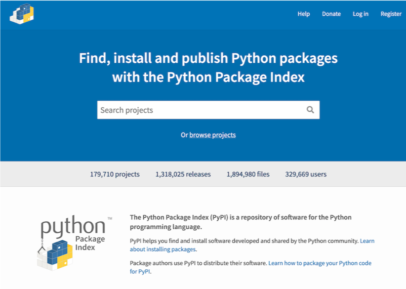
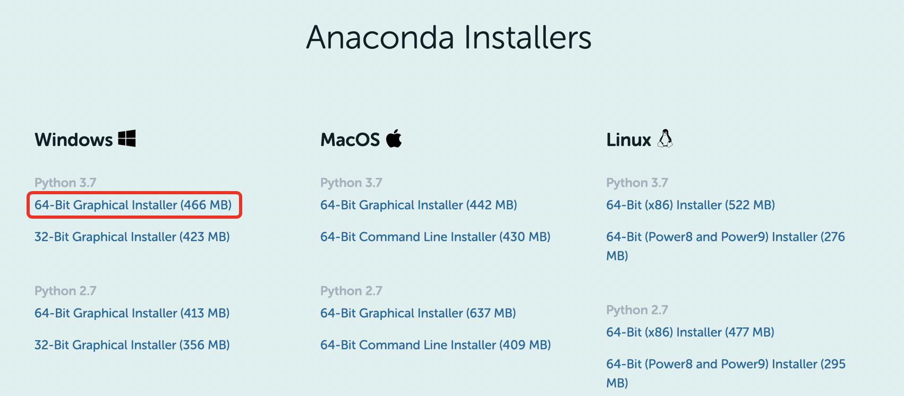
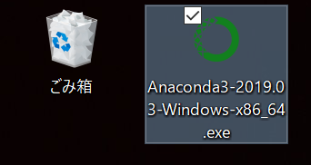
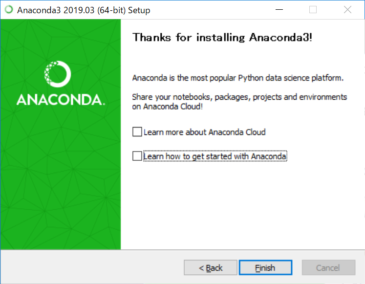
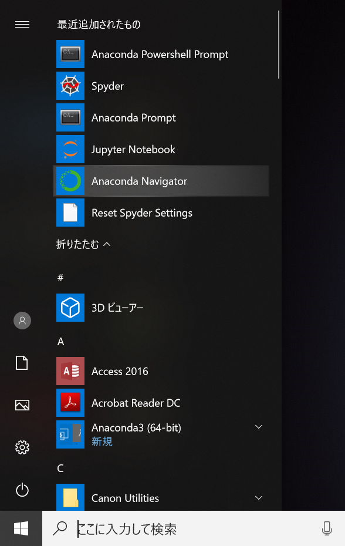
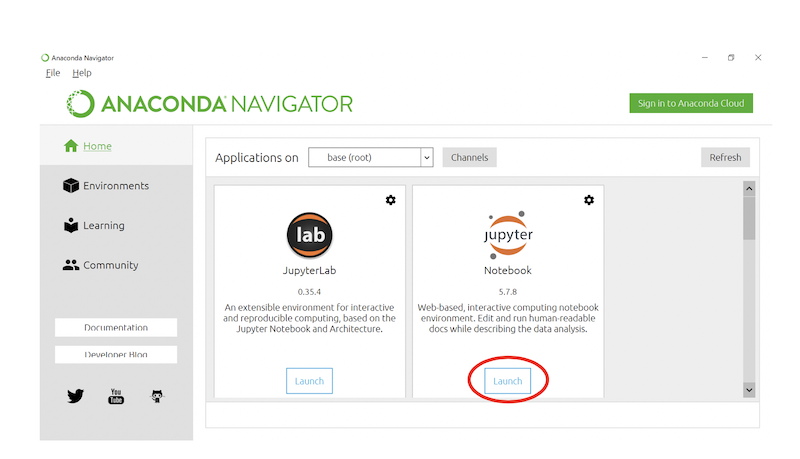
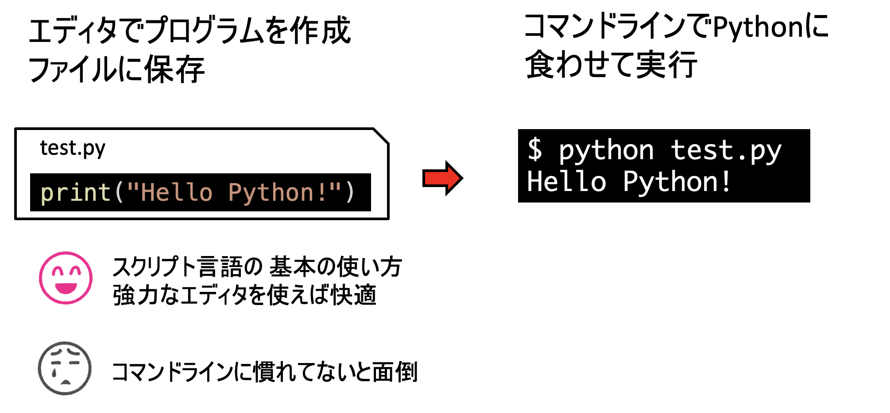
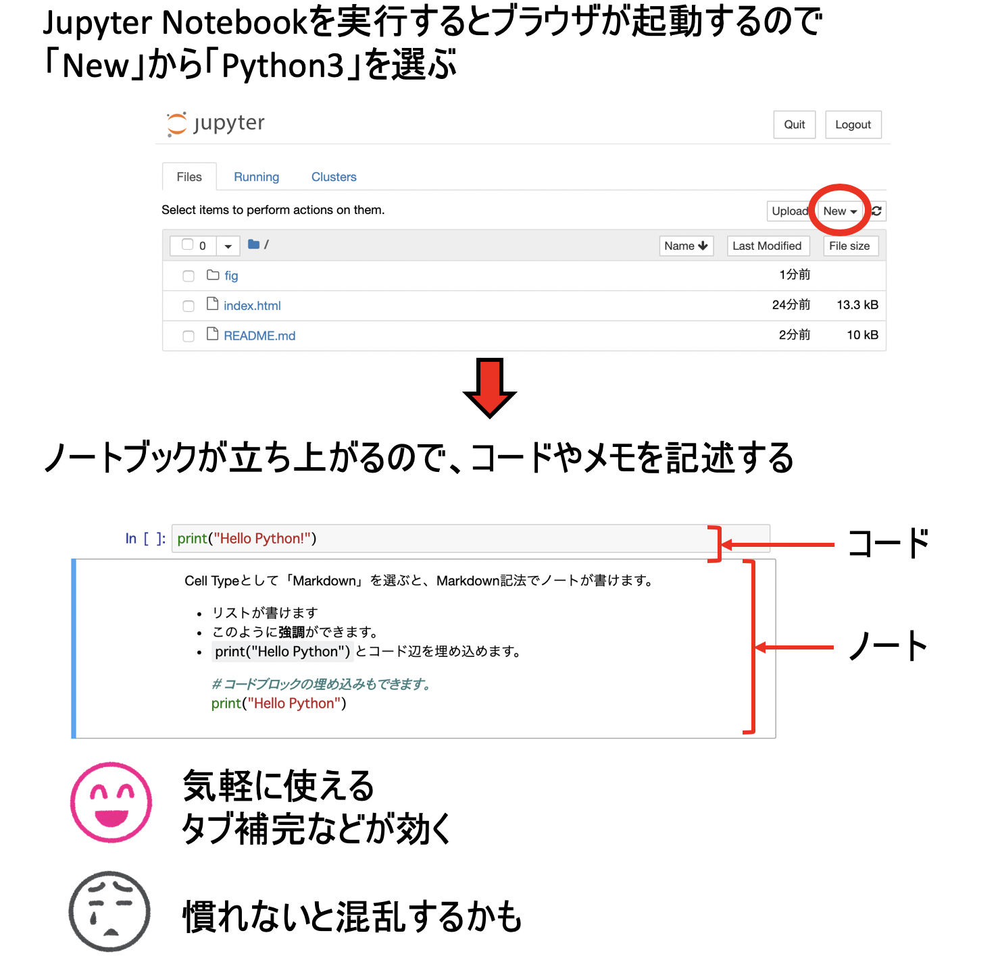

# Pythonのインストール

本書では、原則としてGoogle Colabを用いてオンライン上でPythonを学ぶ。したがってローカルにPythonをインストールする必要はないが、後で必要になることもあるだろう。そこで、手元のPCにPythonをインストールする方法と、その実行方法について簡単に紹介しておく。また、Pythonを使う上で重要な、パッケージについても簡単に触れる。

## Pythonのライブラリについて

Pythonのインストールそのものは難しくない。公式サイトからダウンロードしてインストールするだけである。問題なのはパッケージ管理である。Pythonには最初からよくつかうライブラリが同封されており、標準ライブラリと呼ばれている。しかし、Pythonには標準ライブラリに含まれないライブラリ(サードパーティ製のライブラリと呼ばれる)が大量にある。そして、多くの場合、そのサードパーティのライブラリが使いたくなるであろう。そのようなライブラリがウェブに分散していてはインストールが大変なので、一箇所で管理するリポジトリがある。それがPython Package Index (PyPI)である。

PyPIには誰でもライブラリを登録することができ、2019年5月時点で179710個のプロジェクトが登録されている。



PyPIから欲しいライブラリを探し、ダウンロードしてインストールすることも可能である。しかし、例えば「AというライブラリはBというライブラリに依存している」「CというライブラリはCで書かれているため、ダウンロード後にコンパイルが必要になる」といった状況があり、全部人力で解決するのは面倒である。そこで、パッケージのダウンロードや依存関係の解決などをするpipというコマンドが用意されている。コマンドラインで

```sh
pip install hoge
```

とすると、自動でPyPIから`hoge`を探してきて、依存関係も解決しつつインストールしてくれるようになる。しかし、Python本体にはPython2系とPython3系があり、お互いの互換性には問題がある。さらにライブラリでもバージョンによる互換性の問題が起きたため、「Pythonの環境を管理するマネージャ」が乱立した。このあたりは闇が深いので、ここでは深く突っ込まない。

現在ではPythonの環境構築についてベストプラクティスもあるのであろうが、それはおいおい気になったらやってもらうことにして、ここでは、Anacondaというプラットフォームを紹介する。Anacondaには、科学技術計算に必要なライブラリや、Jupyter Notebookなどよく使うアプリケーションが最初から含まれているため、「とりあえず使ってみたい」という方にメリットが大きい。ただし、他のよく使われるパッケージマネージャとぶつかるため、使っていて気になりだしたら別のパッケージマネージャ(例えばpipenv)などを使えば良い。以下、Anacondaのインストールの仕方を説明しておく。

## Anacondaのインストール

以下、Windowsへのインストールを例に説明するが、MacやLinuxでも手順はほぼ同様である。

Googleで「Anaconda」と検索するか、[https://www.anaconda.com/](https://www.anaconda.com/)にアクセスし、右上にある「ダウンロード」をクリックする。


現れたページの下の方に「Windows | macOS | Linux」のタブが現れるので「Windows」をクリックしてから「Python 3.7 version」の「Download」ボタンを押す。



ダウンロードが完了したら、以下のアイコンをダブルクリックしてインストールを開始する。



すべてデフォルトのままで良いが、途中で自分だけにインストールするか、このPC全員にインストールされるか聞かれるので、適宜対応する。必要なパッケージをほとんど含んでいるため、インストールにはかなり時間がかかる。

インストールが完了したら、「Anaconda Cloud」や「get started」を見るか聞かれる。必要ないので、チェックを外して「Finish」を押す。



Windowsのスタートメニューから、Anaconda Navigatorを実行する。Windows 10だとメニューが折り畳まれている場合もあるので注意。



起動すると必要なパッケージを自動でインストールするため、環境によっては初回起動時に時間がかかるかもしれない。

Navigatorが起動したら、Jupyter Notebookを実行する。以下の画面の「Jupyter Notebook」の下の「Launch」をクリックする。



デフォルトのブラウザで、Jupyter Notebookが開かれるので、右上の「New」ボタンから「Python 3」を選ぶ。


新しいタブが開き、入力待ちになるので、そこで何かプログラムを入力する。例えば

```py
print("Hello Python")
```

と入力し「Shift+Return」もしくは上の「Run」ボタンをクリックする。


セルの真下に「Hello Python」と表示されて、次のセルが入力待ちになれば成功である。これでPythonを実行する環境は整った。

右上の「Quit」を押してサーバを終了する。「Logout」を押して終了しようとすると、Anaconda Navigatorを終了しようとする時に
「Jupyter Notebookが終了していない」と言われるの注意。その場合はそのまま終了して問題ない。

また、次回からはAnaconda Navigatorを経由せず、いきなりJupyter Notebookを実行して良い。「Jupyter Notebook」というタイトルのコマンドライン画面経由でブラウザが起動されるが、「Quit」を押せば、コマンドライン画面は消える。この時も「Logout」を押すとコマンドライン画面が残ってしまうが、その場合はCtrl+Cを何度か押せば消える。

### Anacondaのトラブル

たまに、Anaconda Navigatorを終了しようとすると「Anaconda Navigator is still busy. Do you want to quit?」と言われることがある。しばらくまって、再度終了しようとしてもまた出る場合はそのまま終了して良い。

## Pythonの実行方法

Pythonにはいくつかの実行方法がある。ここではコマンドラインから実行する方法、IPythonを使ってインタラクティブに実行する方法、Jupyter Notebookを使う方法を紹介する。

### コマンドラインから実行



プログラムをファイルに保存し、それをPythonに渡して実行する方法である。別途エディタでプログラムを編集、保存し、コマンドラインでPythonを実行する。

```sh
$ python test.py
Hello Python!
```

スクリプト言語の基本的な使い方であり、Vim、Emacs、VS Codeなど、多くのエディタがPythonに対応しているため、そのような強力なエディタを使っていれば快適な開発環境が得られる。Pycharmという、Python専用のIDE(統合開発環境)もあるので、慣れたら好きなものを使ってほしい。ちなみに筆者のおすすめはVS Code (Visual Studio Code)である。

エディタや開発環境によっては、コマンドラインを全く開かずにGUI環境のみで実行できる場合もあるが、その場合でも一度はコマンドラインで実行し、裏で何が起きているかわかってからコマンドラインを使わない実行に移った方が良いだろう。

### IPythonを使ってインタラクティブに実行


IPythonとはPythonの対話的シェルである。コマンドから`ipython`と実行すると入力待ちになり、そこで対話的にプログラムを入力、実行ができる。タブ補完が効いたり、コードの色がついて見やすくなったりするため、ちょっとしたプログラムを試したりするのに便利である。エディタや統合環境を使ったり、Jupyter Notebookを使う場合でも、この方法を覚えておいて損はない。

### Jupyter Notebookを使う方法



コマンドラインから`jupyter notebook`と入力するか、Anacondaを使っているなら「Anaconda Navigator」で「Jupyter notebook」の「Launch」を押すと、Jupyter Notebook(ジュピター・ノートブック、あるいはジュパイター・ノートブック)が起動する。

こちらはプログラムだけではなく、画像やノートも貼り付けることができ、「プログラムを埋め込むことができる実験ノート」として使える。ノートは保存し、後で開くことも、プログラムを編集して再度実行することもできる。プログラムのタブ補完も効く。本講義で用いるGoogle Colabも、ブラウザからJupyter Notebookが使えるサービスである。

初めてPythonを触るならばJupyter Notebookを使うのが良いと思う。ただし、例えばセル間でグローバル変数を共有したり、「セルの並び順」ではなく「セルを実行した順」にプログラムが実行されるため、書き方が悪いと混乱しやすいかもしれない。とりあえずJupyter Notebookを使いつつ、エディタによる開発に移行するか、併用するのが良い。
