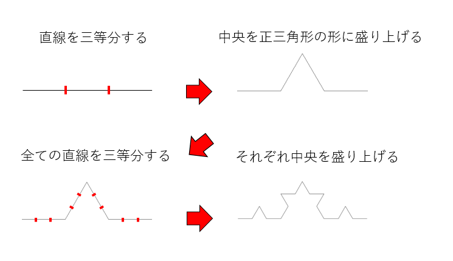
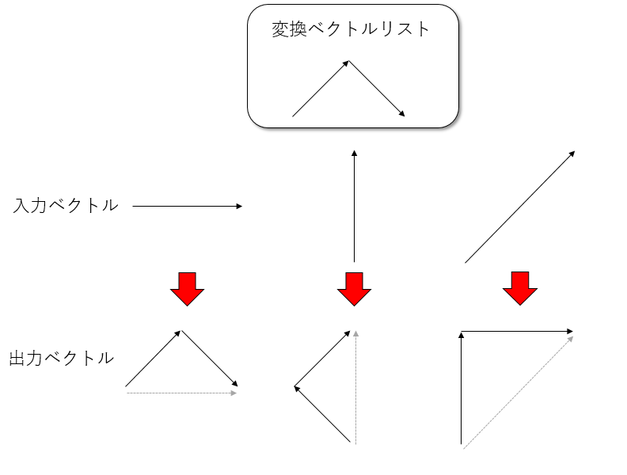

# [リストとタプル](https://kaityo256.github.io/python_zero/list/)

本講の目的。

* リストやタプルの扱いに慣れる
* リスト内包表記を使ってPythonらしく書く

## リスト

プログラムを組んでいると、何かひとまとまりのデータをまとめて保持し、処理したい場合がある。
そのようなデータ構造を表現するのがリスト(list)である。他の言語では配列(array)と呼ぶことが多い。

配列は`[]`の中に、カンマで区切って表現する。例えば、

```py
[1,2,3]
```

とすると、整数の1,2,3を含むリストができる。

また、

```py
["A","B","C"]
```

とすると、文字列のリストができる。リストにはどんなものも入れることができる。また、異なる種類のものを混ぜて入れることもできる。

```py
a = ["A", 1, 1.0]
```

リストの要素には、`[]`でアクセスできる。例えば`a`の最初の要素が欲しい場合は`a[0]`とする。カッコの中の数字を **添え字(index)** と呼ぶ。言語によって、添え字が0始まりの場合と1始まりの場合がある。Pythonは0始まりである。

```py
a = [1,2,3]
a[0] # => 1
```

要素に値を代入することができる。

```py
a = [1,2,3]
a[1] = 5
a # => [1,5,3]
```

リストは入れ子にすることもできる。

```py
a = [[1,2],[3,4],5]
```

入れ子になったリストは、添え字を複数指定することで要素を得ることができる。

```py
a = [[1,2],[3,4],5]
a[0] #=> [1,2]
a[0][1] #=> 2
```

リストの長さは`len`という関数で取得できる。

```py
a = [1,2,3]
len(a) # => 3
```

二つのリストを結合することができる。

```py
[1,2] + [3,4,5] # => [1,2,3,4,5]
```

要素を追加する場合は`append`を使う。

```py
a = [1,2]
a.append(3)
a # => [1,2,3]
```

リストに要素が含まれるかどうかは、`in`で調べることができる。

```py
a = [1,2,3]
1 in a # => True
4 in a #=> False
```

リストの要素を順番に取り出しながら、すべての要素について処理をしたい場合、`for`と`in`を使う。

```py
a = ["A","B","C"]
for i in a:
  print(i)
```

## タプル

タプルは、複数の値の組を表現するデータ構造である。タプルはカンマで区切られた値で表現されるが、紛らわしいときには丸カッコ`()`で囲む。

```py
a = 1, 2, 3
a #=> (1, 2, 3)
```

タプルはリストと同様に`len`で長さを得たり、添え字で要素を得ることができる。

```py
a = 1, 2, 3
a[0] #=> 1
len(a) #=> 3
```

タプルの結合もできる。

```py
(1,2) + (3,4) # => (1,2,3,4)
```

このようにタプルはリストに似ているが、一度作成されたタプルは修正できない。

タプルは関数で複数の値を返したい場合によく使われる。

```py
def func():
  return 1,2

func() #=> (1,2)
```

タプルを使って、複数の変数を一度に初期化することができる。

```py
a, b = 1, 2
a #=> 1
b #=> 2
```

以下のようにすると、変数の値の交換ができる。

```py
a, b = b, a
```

タプルのリストを作ることもできる。

```py
a = [(1,2), (3,4)]
```

その場合、例えば0番目の要素を以下のように変数に代入できる。

```py
a = [(1,2), (3,4)]
x, y = a[0] # x = 1, y = 2になる
```

リストとタプルについて覚えて起きたいことは他にもいろいろあるが、それは必要に応じて説明していくことにしよう。

## コッホ曲線の描画

コッホ曲線を知っているだろうか。こんな図形である。


名前を知らなくても、その形は見たことがあるかと思う。この曲線は、以下のような手続きで作成される。

1. まず線分を用意する
2. 線分を三等分する
3. 中央の線分を、正三角形の形に盛り上げる

この手続きをすると、一本の線分が4本の線分に変換される。こうしてできた4本の線分のそれぞれに同様な手続きを繰り返すと、コッホ曲線ができあがる。



コッホ曲線は、再帰を使って描画するのが自然だが、今回はリストとタプルを駆使してコッホ曲線を描くプログラムを組んでみよう。

コッホ曲線とは、すべてつながった線分から構成されている。したがって、ある点から、次の点へのベクトルの集合とみなすことができる。さて、あるベクトルが与えられたとき、それをどのように変換したいかを表現したベクトルのリストを与えて変換することを考える。


コッホ曲線では、最初にx方向に伸びた長さ1の線分がある。これを二次元ベクトル$(1,0)$で表現する。これを入力したら$(1/3, 0), (1/6, \sqrt{3}/6), (1/6, -\sqrt{3}/6), (1/3,0)$の4つのベクトルに変換したい。ここで、最初に与えたベクトルと、変換で与えたベクトルの始点から終点の長さが等しいことに注意せよ。ただ、変換リストを、長さを考えながら与えるのは面倒だ。変換リストとして$(1, 0), (1/2, \sqrt{3}/2), (1/2, -\sqrt{3}/2), (1,0)$を与えたら、長さを自動調節するようにしよう。
また、傾いたベクトルを入力したら、傾いた4つのベクトルにする。


このような変換プログラムを書いたら、最初にタプルのリスト`[(1,0)]`を入力すると、それを変換した4つのタプルのリストに変換され、さらにそれを変換したら16個のタプルのリストに変換され・・・と、この処理を繰り返すことでコッホ曲線を表現するベクトルのリストを作ることができる。以下、そのプログラムを少しずつ作っていこう。

### タプルのリスト

まず、長さの自動調節のため、変換ベクトルのリストが与えられたら、始点と終点を結ぶベクトルの長さを求めよう。変換ベクトルリストは、タプルのリストとして与える。これは要するに、リストに入っているタプルのx座標、y座標をそれぞれ合計すればよい。新しいノートブックを開き、最初と次のセルに以下を入力せよ。

```py
from math import sqrt
from PIL import Image, ImageDraw
import IPython
```

```py
def length(a):
    x, y = 0, 0
    for (dx, dy) in a:
        x += dx
        y += dy
    return sqrt(x**2 + y**2)
```

それぞれのセルを実行したら、意図通りに実行されるかテストしてみよう。タプルが一つだけ含まれるリストが与えられたら、そのベクトルの長さが返ってくるはずである。三番目のセルに以下を入力し、実行せよ。

```py
a = [(1,1)]
print(length(a)) # => 1.4142135623730951
```

次に、複数のベクトルが与えられたら、その合成ベクトルの長さが返ってくる。例えば$(1,0)$と$(0,1)$が与えられたら、始点と終点を結ぶベクトルは$(1,1)$となるので、その長さ$\sqrt{2}$が返る。

```py
a = [(1,0),(0,1)]
print(length(a)) # => 1.4142135623730951
```

また、始点と終点が一致する場合、つまり閉曲線が与えられたら、長さは0である。

```py
a = [(1,0),(0,1),(-1,-1)]
print(length(a))  #=> 0.0
```

このように、値が0になるような特殊なケースをテストしておくのは重要である。確認が終わったら、テスト用のセル(`print`を含むもの)は削除して良い。

### タプルからリストを作成

次に、入力ベクトルを、変換ベクトルリストに基づいて変換することを考えよう。処理は以下の通りである。

* 入力ベクトルの長さと変換ベクトルリストの長さの比`scale`を求める
* 入力ベクトルの傾き角度$\theta$の$sin$と$cos$の値を求める
* 変換ベクトルリストに含まれるベクトルそれぞれについて、`scale`倍して$\theta$だけ傾けたものをリストに追加する

以上を実現する以下のコードを、3つ目のセルに入力せよ。

```py
def convert(a, b):
    ax, ay = a
    alen = sqrt(ax**2+ay**2)
    c = ax/alen
    s = ay/alen
    scale = alen/length(b)
    r = []
    for (bx, by) in b:
        bx *= scale
        by *= scale
        nx = c * bx - s * by
        ny = s * bx + c*by
        r.append((nx, ny))
    return r
```

上に書いた処理そのままなので、難しくはないと思う。`for (bx, by) in b`は、リストに含まれる要素を`(bx, by)`というタプルで受けるという意味だ。より冗長に書けば、

```py
for bi in b:
  bx, by = bi
```

というような意味である。さて、意図通りの動作をするか確認しよう。コッホ曲線は60度傾いており、確認が面倒なので、まずは90度傾いた変換ベクトルリストを食わせて実行してみよう。

```py
a = (1,0)
b = [(1,1),(-1,1)]
convert(a,b) #=> [(0.5, 0.5), (-0.5, 0.5)]
```

入力ベクトルと出力ベクトルの、始点と終点を結ぶベクトルが一致しており、かつ出力ベクトルと変換ベクトルリストが相似になっていることを確認せよ。

```py
a = (0,1)
b = [(1,1),(-1,1)]
convert(a,b) #=> [(-0.5, 0.5), (-0.5, -0.5)]
```

```py
a = (1,1)
b = [(1,1),(-1,1)]
convert(a,b) #=> [(0.0, 1.0), (-1.0, 0.0)]
```

それぞれの図解すると以下の通り。



ここまで出来たら、テスト用のセルは削除してよい。

### タプルのリストそれぞれに適用

今、「ベクトルをタプルとして与えられたら、変換ベクトルリストに従って、タプルのリストに変換する関数」を`convert`として実装した。これを使えば、「タプルのリスト」が与えられたとき、それぞれのタプルに`convert`を適用した結果をまとめたリストを作る関数`apply`は簡単に実装できる。以下を4つ目のセルに入力せよ。

```py
def apply(a, b):
    r = []
    for i in a:
        r += convert(i, b)
    return r
```

入力したら動作確認しよう。`apply`はタプルのリストを引数に取る関数である。なので、まずはタプルを一つだけ含むリストを食わせてみよう。`convert`の実行結果をリストに入れたような結果が返ってくるはずである。

```py
a = [(1,0)]
b = [(1,1),(-1,1)]
apply(a,b) # => [(0.5, 0.5), (-0.5, 0.5)]
```

次に、複数のタプルを含むリストを食わせてみよう。一つのベクトルを二つのベクトルに変換するので、二つ食わせれば四つのベクトルになる。

```py
a = [(1,0),(0,1)]
b = [(1,1),(-1,1)]
apply(a,b) # => [(0.5, 0.5), (-0.5, 0.5), (-0.5, 0.5), (-0.5, -0.5)]
```

さて、タプルのリストを処理できるようになったことで、「一度`apply`を適用した結果に、さらに`apply`を適用する」ということができるようになった。以下のコードを実行し、結果が正しいか考察せよ。

```py
a = [(1,0)]
b = [(1,1),(-1,1)]
for _ in range(2):
    a = apply(a,b)
print(a)
```

また、`range`の中の数字を増やしてみよ。`print(len(a))`を表示し、想定通りの長さのリストになっているか確認せよ。

動作確認ができたら、テスト用のコードは削除してよい。

### 描画

ベクトルのリストが与えられたら、描画するのは難しくない。与えられたベクトルの通りに線を描画すればよい。ただし、線を描画したら、次に描画する始点を、現在の終点に取り直す必要がある。

以下のプログラムを、5つ目と6つ目のセルに入力し、実行してみよ。

```py
def draw_line(draw, a, s = (0,0)):
    x1, y1 = s
    for (dx, dy) in a:
        x2 = x1 + dx
        y2 = y1 + dy
        draw.line((x1, y1, x2, y2), fill=(255, 255, 255))
        x1, y1 = x2, y2
```

```py
size = 512
im = Image.new("RGB", (size, size))
draw = ImageDraw.Draw(im)
a = [(size, 0)]
b = [(1, 0), (0.5, sqrt(3.0)/2), (0.5, -sqrt(3.0)/2), (1, 0)]
for _ in range(1):
  a = apply(a, b)
draw_line(draw, a)
im.save("test.png")
IPython.display.Image("test.png")
```

ちゃんと、コッホ曲線の一段階目の変換ができただろうか。できていたら、`range`の数字を増やしてみよ。最大でも5くらいにとどめておくこと。

### 課題1

`b`のリストに好きなベクトル列を入れて、オリジナルのフラクタル曲線を作成せよ。

例えば、繰り返し数を`range(1)`としてから、

```py
b = [(1,0),(0,1),(1,0),(0,-1),(1,0)]
```

として描画し、繰り返し数を増やした場合にどんな図形になるか想像してみよ。想像した後に`range(5)`に変えて描画し、想像と合致していたか確認せよ。

### 任意課題

コッホ曲線の入力として正三角形を与えることもできる。

```py
size = 512
im = Image.new("RGB", (size, size))
draw = ImageDraw.Draw(im)
sx = size/3 # 追加
sy = sx * sqrt(3) # 追加
a = [(sx,sy),(sx,-sy),(-2*sx,0)] # 修正
b = [(1, 0), (0.5, sqrt(3.0)/2), (0.5, -sqrt(3.0)/2), (1, 0)]
for _ in range(5):
  a = apply(a, b)
draw_line(draw, a, (size/6,size/4)) # 修正
im.save("test.png")
IPython.display.Image("test.png")
```

実行前に、どんな図形になるか、想像してから実行せよ。今回は変換を5回繰り返してできる図形を表示したが、変換を無限回繰り返した場合、この図形の周囲の長さと面積がそれぞれどうなるか考えよ。

## enumerateについて

`for x in a:`という構文で、リスト`a`のそれぞれの要素`x`について処理をすることができる。しかし、たまに「要素の値」と、「その要素がリストの何番目にあるか」の情報が両方欲しい場合がある。その時に使うのが`enumerate`だ。

例えば、こんなことができる。

```py
a = ["A","B","C"]
for i, x in enumerate(a):
  print(i, x)
```

実行結果はこうなる。

```py
0 A
1 B
2 C
```

これを念頭において、コッホ曲線の線分に色を塗るプログラムを組んでみよう。

### 課題2

以下のプログラムを空いているセルに入力せよ。

```py
def draw_line_color(draw, a, c, s = (0,0)):
    x1, y1 = s
    clen = len(c)
    for i, (dx, dy) in enumerate(a):
        x2 = x1 + dx
        y2 = y1 + dy
        draw.line((x1, y1, x2, y2), fill=c[i%clen])
        x1, y1 = x2, y2
```

```py
size = 512
im = Image.new("RGB", (size, size))
draw = ImageDraw.Draw(im)
a = [(size, 0)]
b = [(1,0),(0,1),(1,0),(0,-1),(1,0)]
c = [(255,0,0)] # 色リストの指定
for _ in range(5):
    a = apply(a, b)
draw_line_color(draw, a, c)
im.save("test.png")
IPython.display.Image("test.png")
```

色リストの指定部分を、以下のように変えたらどうなるか試してみよ。

二色の場合

```py
c = [(255,0,0),(0,0,255)]
```

三色の場合

```py
c = [(255,0,0),(0,0,255),(0,255,0)]
```

色の指定と、変換ベクトルリストをいろいろ変えてみて、オリジナルのフラクタル図形を作成せよ。

## Pythonらしく書く

TODO: リストの内包表記の説明

### 内包表記

リストの内包表記は「後ろから」読む。

```py
a = [1,2,3]
[2*x for x in a]
```

`[2*x for x in a]`は「aに含まれるxそれぞれを2*xにしたような新しいリストを作成してください」という意味になる。

```py
def convert(a, b):
    ax, ay = a
    alen = sqrt(ax**2+ay**2)
    c = ax/alen
    s = ay/alen
    scale = alen/length(b)
    r = []
    b = [(scale*x, scale*y) for (x,y)) in b]
    for (bx, by) in b:
        nx = c * bx - s * by
        ny = s * bx + c*by
        r.append((nx, ny))
    return r
```

```py
def convert(a, b):
    ax, ay = a
    alen = sqrt(ax**2+ay**2)
    c = ax/alen
    s = ay/alen
    scale = alen/length(b)
    b = [(scale*x, scale*y) for (x, y) in b]
    b = [(c * x - s* y, s *x + c * y) for (x, y) in b]
    return b
```

`bx, by`や`r`が消えた。

### reduce

TODO: `reduce`と`lambda`の説明。

```py
def length(a):
  (x, y) = reduce(lambda x, y: (x[0]+y[0], x[1]+y[1]),a)
  return sqrt(x**2 + y**2)
```

```py
def apply(a, b):
  c = [convert(i, b) for i in a]
  return reduce(lambda x, y: x + y, c)
```