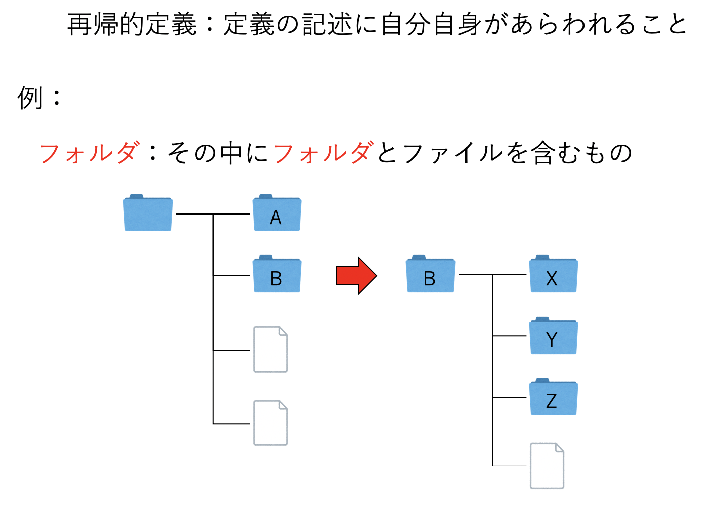
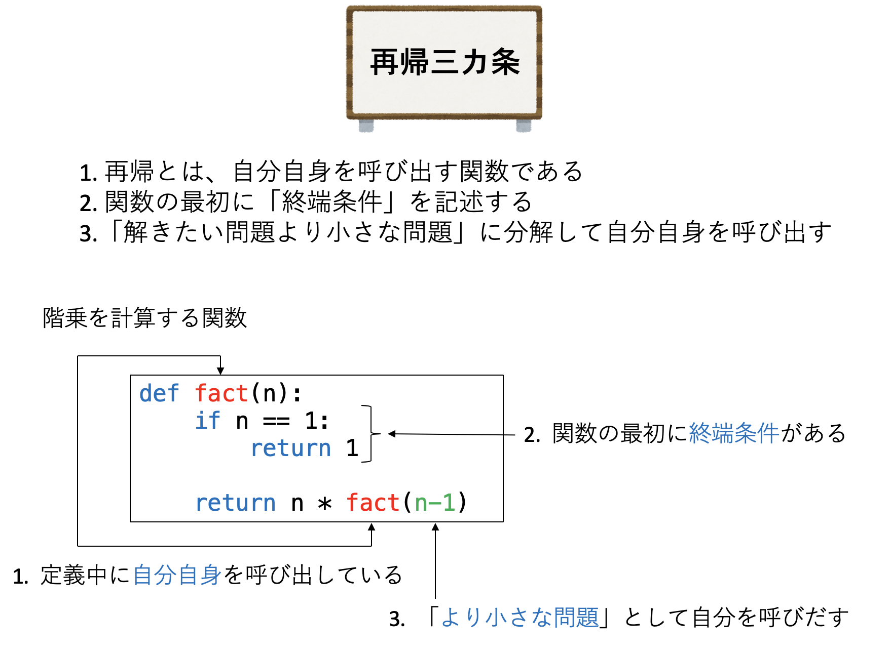
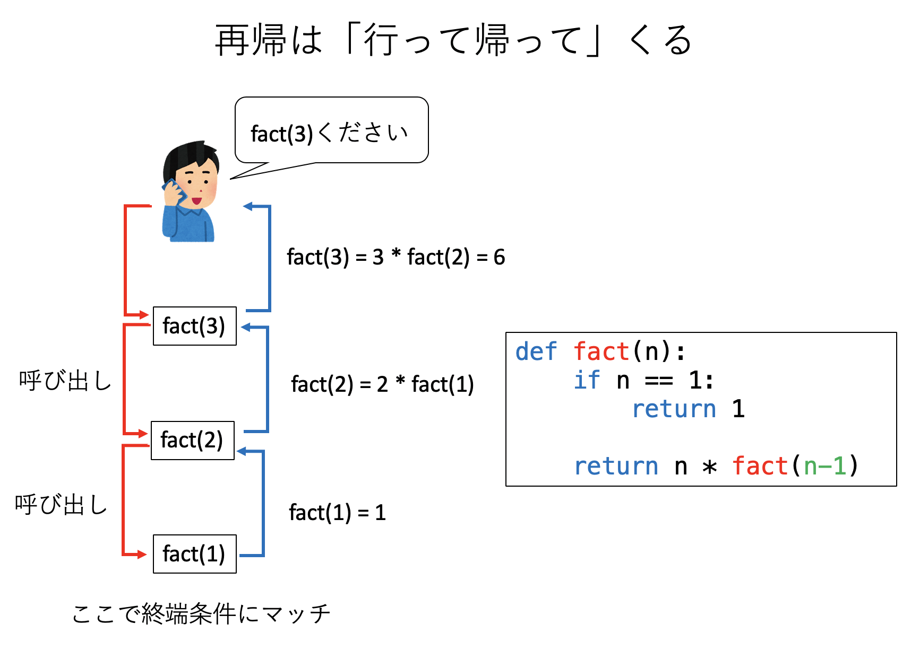
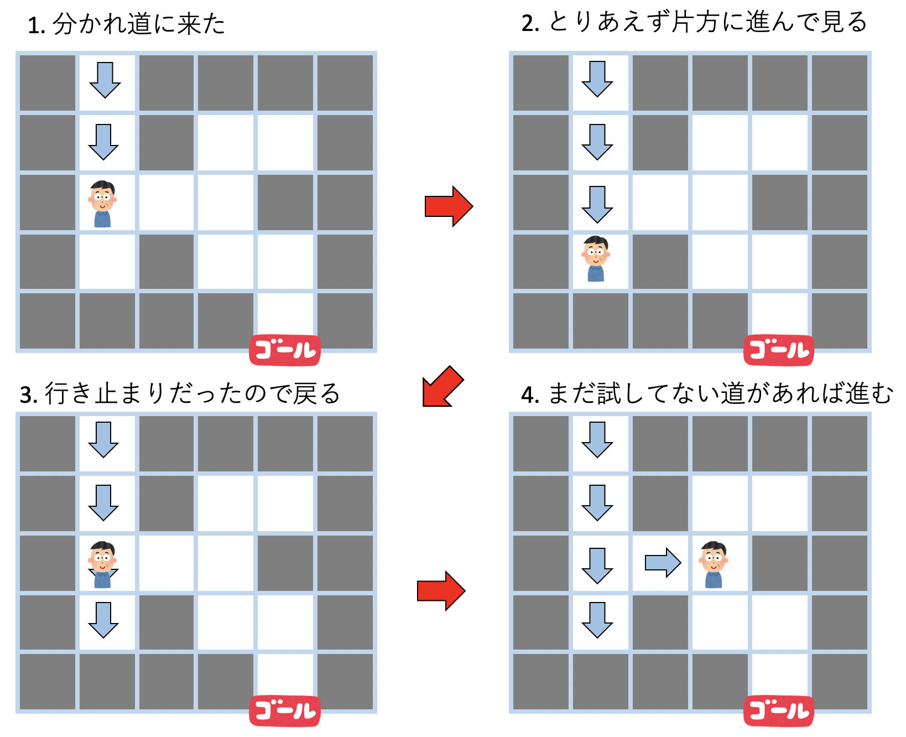

# [再帰呼び出し](https://kaityo256.github.io/python_zero/recursion/)

## 本講で学ぶこと

* 再帰呼び出しとは
* 階段の登り方問題
* 迷路

## 再帰呼び出しとは

例えばパソコンを使っているとフォルダを扱うであろう。フォルダを開くと、その中にはやはりフォルダとファイルが含まれる。この事実をもって「フォルダ」という言葉を定義しようとすると「フォルダとは、フォルダとファイルを含むものである」となる。「フォルダ」の記述に、定義したい言葉である「フォルダ」が含まれていることがわかる。このように、何かの中に、その何かそのものが現れることを **再帰(Recursion)** と呼び、何かの定義に自分自身が現れることを **再帰的定義(Recursive Definition)** と呼ぶ。



プログラムにおける再帰とは、簡単に言ってしまえば「自分自身を呼び出す関数」のことである。プログラムにおいて関数の実装は「この関数が呼び出されたらこのような処理をせよ」という、定義にほかならない。ある関数の定義に、その関数そのものが含まれるので、これは再帰的な記述になっている。このように関数が自分自身を呼び出すことを **再帰呼び出し(Recursive Call)** と呼ぶ。以下、再帰予び出しを用いるアルゴリズムやプログラムを総称して単に「再帰」と呼ぶ。

再帰は慣れると極めて強力なアルゴリズムであり、中級以上のプログラマになるためには必須のプログラミング技法である。しかし、プログラムの初学者にとって再帰はループ構造や制御構造に比べてその動作ステップをイメージしづらく、「初学者の壁」となっている。今回はそんな「再帰呼出し」を学ぶが、再帰はなんども組んでいるうちにおぼろげに感覚を掴んでくるものであって、たった一回の講義で理解することは難しい。とりあえず、以下の「再帰三カ条」だけを覚えておいて欲しい。

再帰三カ条

* 再帰とは、自分自身を呼び出す関数である
* 関数の最初に「終端条件」を記述する
* 「解きたい問題より小さな問題」に分解して自分自身を呼び出す

必ずしも上記の形に当てはまらない再帰もあるが、それはその時に学べばよい。まずは上記三カ条が再帰の基本だと覚えておけばよい。

簡単な例として、自然数nの階乗を返す関数`fact(n)`を考えてみよう。これは1からnまでの数の積だ。

$$
n! = 1 \cdot 2 \cdots n-1 \cdot n
$$

これをプログラムで計算したい。もちろん、以下のようにループを回してしまうのが簡単だ。

```py
def fact(n):
    a = 1
    for i in range(1, n+1):
        a *= i
    return a
```

しかし、ここでは再帰の考え方を学ぶためにあえて再帰で書いてみよう。

再帰プログラムの基本は「今解きたい問題よりも小さな問題の答えがすべてわかっている場合、いま解きたい問題の答えはどう記述できるだろうか？」という考え方である。

nの階乗の値、`fact(n)`の値を知りたい時、もし(n-1)の階乗の値`fact(n-1)`がわかっているとしよう。すると、欲しい値はそれにnをかけたものだ。つまり、

```py
fact(n) = n * fact(n-1)
```

である。関数のある値を得るのに、その関数自身を使っている、再帰的な記述になっているのがわかるであろう。

さて、`fact(n-1)`の値は`fact(n-2)`にn-1をかけたものであり、`fact(n-2)`は`fact(n-3)`の値にn-2をかけたもので・・・とどんんどん`fact`の中身が小さくなり、いつかは`fact(1)`になるであろう。1の階乗は1であり、ここで終了である。

以上から、階乗を求めるプログラムを再帰を使って書くとこうなる。

```py
def fact(n):
    if n == 1:
        return 1

    return n * fact(n-1)
```

これが、先ほどの「再帰三カ条」に従っていることを確認しよう。

* 再帰とは、自分自身を呼び出す関数である
  * `fact`の定義に、`fact`自身が使われている
* 関数の最初に「終端条件」を記述する
  * 引数`n`として1が指定されたら1を返して終了
* 「解きたい問題より小さな問題」に分解して自分自身を呼び出す
  * 自分が受け取った引数`n`に対して、`n-1`を引数として自身を呼び出している



実際にこの関数`fact`の動作を見てみよう。例えば`fact(3)`として呼び出すことを考える。

1. まず3は1ではないので終端条件にはマッチせず、`fact(2)`が呼ばれる
2. 同様に`fact(1)`が呼ばれる
3. `n`として1が代入されて呼ばれた`fact(1)`は、終端条件にマッチして1を返す
4. `fact(1)`を呼んだ`fact(2)`は、`fact(1)`の返り値1に2をかけた2を返す
5. `fact(2)`を呼んだ`fact(3)`は、`fact(2)`の返り値2に3をかけた6を返して値が確定



つまり、再帰関数はどんどん問題を小さくしながら自分自身を呼び出していき、どこかで「終端条件」に達すると、そこから呼び出し履歴を逆にたどりながら帰ってくる。標語的に言えば「再帰は行って返って」くる。この「問題を棚上げしながら単純化していき、どこかで終端条件に達したら、これまで棚上げにした問題を解決しながら戻ってくる」という感覚を身につけることが再帰プログラムの肝である。

## 階段の登り方問題

先程の階乗を求める問題は、あまりに簡単過ぎて再帰を使うメリットが感じられなかったであろう。そこで、もう少し複雑な問題として「階段の登り方問題」を考えよう。

いま、目の前に$n$段の階段があるとする。一度に1段、もしくは2段登るやり方を混ぜて登る時、「登り方の総数」は全部で何通りあるだろうか？


まずは$n$が小さい時の場合を考えてみよう。$n=1$の時、つまり1段しかない時には、1段で登るしかないので1通りである。2段ある場合は、1段ずつ2回で登るか、2段で一度に登るかの2通りである。ここで、1もしくは2をいくつか足して、その合計をNにするようなやり方を数えれば良い、ということに気がつくであろう。例えば$n=3$なら、

$$
\begin{aligned}
3 &= 1 + 1 + 1\\
3 &= 1 + 2 \\
3 &= 2 + 1
\end{aligned}
$$

の3通りである。$n=4$なら、

$$
\begin{aligned}
4 &= 1 + 1 + 1 + 1\\
4 &= 1 + 1 + 2 \\
4 &= 1 + 2 + 1 \\
4 &= 2 + 1 + 1 \\
4 &= 2 + 2 \\
\end{aligned}
$$

の5通りである。さて、これを一般化して、$n$段の時の登り方$F_n$はどのように求めればよいだろうか？このような場合に「再帰的」な考え方をする。

再帰プログラムの基本は「今解きたい問題よりも小さな問題の答えがすべてわかっている場合、いま解きたい問題の答えはどう記述できるだろうか？」と考えることであった。今、$n-1$段までの登り方、$F_1, F_2, \cdots F_{n-1}$が全てわかっているとしよう。その知識を使って、$F_n$の値を求められないだろうか？

最初のステップを考えよう。眼の前に$n$段の階段がある。できることは、1段登るか、2段登るかの二通りである。さて、1段登ったら、残りは$n-1$段であるから、その登り方は$F_{n-1}$通りである。2段登ったら残りは$n-2$段であるから、その登り方は$F_{n-2}$通りである。最初のステップでできることはこの二つしかなく、それらは重複しないので、階段の登り方の総数はその二通りの和である。

ここから、漸化式

$$
F_n = F_{n-1} + F_{n-2}
$$

が成り立つことがわかる。さて、左辺にも右辺にも「登り方$F$」が登場する。つまり、ある$F$を、別の引数をもった$F$自身で、再帰的に表現していることがわかる。さらに、左辺に比べて右辺は問題サイズ$n$が小さいことがわかるであろう。つまり、ある大きさ$n$をもつ問題が、それより小さいサイズの$n-1$と$n-2$という問題を解くことに帰着された。これが再帰の考え方である。すなわち、再帰アルゴリズムは本質的に**分割統治法**である。

後の課題で階段の登り方問題を実装し、それがどうやって「行って帰って」来るかを見てみよう。

## 迷路

再帰のもう少し実用的(？)な例として、迷路を解くプログラムを考えよう。迷路が与えられた時に、スタート地点からゴール地点までの経路を探索するのが目的である。

このような探索で問題となるのが、「分かれ道」の存在である。いま、分かれ道に直面したとしよう。どちらが正解かわからないので、とりあえず現在地を覚えておいて、片方の道を試し、もしその先が行き止まりなら先程覚えておいた位置まで戻ってきて、別の道を試す必要がある。もし試しに選んだ片方の道の先にまた分かれ道があったら、また現在地を覚えておいて、片方を試す、という行動を繰り返す。

このように「とりあえずあっちへ進んで、ダメなら戻る」という行動を繰り返すようなアルゴリズムを **バックトラック(backtracking)** と呼ぶ。将棋や囲碁のようなゲームで「先の手を読む」場合や、ナンプレなどのようなゲームで数字を仮り置きして矛盾したら戻ってやりなおす場合など、広く使われるアルゴリズムなので、これまでも無意識に使ったことはあるだろう。


このような「とりあえずあっちへ進んで、ダメなら戻る」というバックトラックは、再帰を使うときれいに書ける。このバックトラックを使って迷路を解くアルゴリズムを考えよう。

単にゴールにたどり着くだけなら、「矢印」を残しながら進んでいけば良い。例えばこんなアルゴリズムになる。

* 自分の進む向きに矢印を書きながら進む
* 分かれ道に来たら、とりあえずどちらかを選ぶ
* 進んだ先が行き止まりになったら、矢印を逆向きに戻る
* 戻っている時に、まだ試していない道があったらそちらを選ぶ



戻る時、つまり矢印と逆向きに進んでいる時にまだ試してない道を見つけたら必ずそこを試すのがポイントである。これにより、「戻っている時には、その後ろにある経路はすべて探索済みである」つまり、「道の見落としが無い」ということが保証される。バックトラックで迷路探索とは、要するに「見落としが無いようにしらみつぶしに探しましょう」ということを言っているに過ぎない。

このように、とりあえず進めるだけ進んで、行き止まりに行き当たったら戻ってくる、というような探索アルゴリズムを **深さ優先探索(depth-first search)** と呼ぶ。逆に、自分がいまいる地点から徐々に探索範囲を広げながら探索する方法を **幅優先探索(breadth first search)** と呼ぶ。ここでは深入りしないが、「そういう用語がある」ということだけぼんやり覚えておけば良い。

さて、単にゴールにたどり着くだけなら上記の方法で良いが、ゴールまでの経路を求めるには少し工夫が必要だ。方針としては、「スタート地点からの距離」を各部屋に記しながら進んで行く。探索が終わったら、全ての場所に「スタート地点からの距離」があるはずである。この状態でゴールから、「数字が減るように」進んでいく。分かれ道では「カウントが減る方」がスタートに至る道であるから、そちらを選び続ければ「ゴールからスタートへの道」が完成する。


課題では、指定された迷路について、「スタート地点からの距離地図」の作成、及び「距離地図が完成した後に解の経路作成」のそれぞれの処理を再帰で実装しよう。

# 再帰呼び出し：課題

## 課題1：階段の登り方問題

新しいノートブックを開き、`kaidan.ipynb`として保存せよ。

### 課題1-1：再帰の実装

#### 1. ライブラリのインポート

直接再帰には関係ないが、後で再帰木を可視化をするために必要なライブラリをインポートしておこう。

```py
from graphviz import Digraph
import IPython
```

#### 2. 再帰関数`kaidan`の実装

2つ目のセルに、`n`段の階段の登り方を返す関数`kaidan(n)`を実装しよう。

```py
def kaidan(n):
    # ここを埋めよ
```

実装すべきは終端条件と再帰部分である。終端条件は以下の二つであった。

* 終端条件：`n`が1の時には1を返す(`kaidan(1)`=1)
* 終端条件：`n`が2の時には2を返す(`kaidan(2)`=2)

これは「nが1もしくは2ならば、nを返す」と実装すればよい。

nが1でも2でもない場合は、`kaidan(n-1)`と`kaidan(n-2)`の和を返せば良い。

#### 3. `kaidan`の確認

関数`kaidan`が実装できたら動作確認をしてみよう。3つ目のセルで以下を実行せよ。

```py
kaidan(3)
```

答えが3になっただろうか？また、`kaidan(4)`が5に、`kaidan(5)`が8になることを確認せよ。`kaidan(10)`の値はどうなるだろうか？

### 課題1-2：再帰木の表示

再帰プログラムの難しさは、「プログラムがどのように実行されるかが分かりづらい」という点にある。繰り返すや条件分岐はそのままたどれば良いのだが、再帰プログラムは何度も自分を呼び出し、そして呼び出し先から返ってくる。この振る舞いを可視化してみよう。

#### 4. 再帰木の可視化関数`kaidan_g`の実装

4つ目のセルに以下を実装しよう。これはグラフオブジェクト`g`を受け取り、階段の登り方がどのように呼び出されているかを可視化する関数だ。

```py
def kaidan_g(n, g, nodes, parent=None):
    index = str(len(nodes))
    nodes.append(index)
    g.node(index, str(n))

    if parent is not None:
        g.edge(index, parent)

    if n in (1, 2):
        return
    kaidan_g(n-1, g, nodes, index)
    kaidan_g(n-2, g, nodes, index)
```

#### 5. 再帰木の可視化

では、先程実装した`kaidan_g`を利用して、再帰木を可視化してみよう。5つ目のセルに以下を入力、実行せよ。

```py
graph = Digraph(format="png")
kaidan_g(5, graph, [])
graph.graph_attr.update(size="10,10")
graph.render("test")
IPython.display.Image("test.png")
```

無事に再帰木が表示されただろうか？数字が`kaidan(n)`として呼び出された`n`の値である。`kaidan(5)`は`kaidan(4)`と`kaidan(3)`を呼び出し、`kaidan(4)`は`kaidan(3)`と`kaidan(2)`を呼び出し・・・と、再帰的に呼び出しが続いていき、`n=1`もしくは`n=2`で呼び出しが止まる(終端条件)ことがわかるであろう。

もし正しく表示されたら、2行目を`kaidan_g(8, graph, [])`などとして、少し大きな再帰木も表示してみよ。

## 課題2：再帰による迷路の解法

### 課題2-1 迷路を解く

#### 1.必要なライブラリのインポート

最初のセルで、必要なライブラリをインポートしておこう。

```py
import pickle
import IPython
from PIL import Image, ImageDraw
from matplotlib import pyplot as plt
```

#### 2. 迷路データのダウンロード

次に、迷路データをダウンロードする。

```py
!wget https://kaityo256.github.io/python_zero/recursion/maze.pickle
```

これは二次元リストをPickle(漬物)という方法で保存したものだ。

#### 3. 迷路データの可視化

迷路の状態を可視化し、ファイルに保存する関数`save_image`を実装しよう。3つ目のセルに以下を実装せよ。

```py
def save_image(maze, filename = "test.png"):
    g = 10
    w = len(maze)
    h = len(maze[0])
    white = (255, 255, 255)
    im = Image.new("RGB", (w*g, h*g), white)
    draw = ImageDraw.Draw(im)
    for ix in range(w):
        for iy in range(h):
            x = ix*g
            y = iy * g
            s = maze[ix][iy]
            color = white
            if s == '*':
                color = (0, 0, 0)
            elif s == 'S':
                color = (0, 0, 255)
            elif s == 'G':
                color = (0, 255, 0)
            elif s == '+':
                color = (255, 0, 0)
            if isinstance(maze[ix][iy], int):
                color = (128, 128, 128)
            draw.rectangle((x, y, x+g, y+g), fill=color)
    im.save(filename)
    plt.imshow(Image.open(filename))
```

#### 4. 迷路データの読み込み

`save_image`が正しく実装できたか確認しよう。Pickle(漬物)になっている迷路データを読み込み、表示してみる。以下を4番目のセルで実行せよ。

```py
with open('maze.pickle', 'rb') as f:
    maze = pickle.load(f)
save_image(maze)
```

左上にスタート地点(青)、右下にゴール地点(緑)がある迷路が表示されたはずだ。

#### 5. 迷路を解くルーチン

ではさっそく迷路を解く(実際には距離地図を作る)関数`solve`を書いてみよう。やるべきことは単純で、

* 進もうとした方向が壁`*`ならそこには行かない
* すでに足跡が残っている(`maze[x][y]`に数字が入っている)なら、そこは探索済みなので行かない

というのが終端条件であり、終端条件に該当しない場合は、その場所に足跡を残し、上下左右へ探索すれば良い。

以上をそのまま実装すると以下のようになる。

```py
def solve(x, y, step, maze):
    if maze[x][y] == '*':
        return
    if isinstance(maze[x][y], int):
        return
    maze[x][y] = step
    solve(x+1, y, step+1, maze)
    solve(x-1, y, step+1, maze)
    solve(x, y+1, step+1, maze)
    solve(x, y-1, step+1, maze)
```

`isinstance`は、与えられたオブジェクト(変数)がどういうタイプかを調べる関数であり、`isinstance(a, int)`などとすると、オブジェクト`a`が整数であるかどうかを調べる。ここでは、迷路の指定の場所`maze[x][y]`に整数が入っているかどうかを調べている。

#### 6. 迷路を解く

6つ目のセルで、迷路を解くルーチンを呼び出してみよう。迷路を解いた(`solve`を呼んだ)後に迷路の状況を可視化するコードである。

```py
solve(1, 1, 0, maze)
save_image(maze)
```

すべてのセルが灰色(探索済み)になったはずである。

#### 7. 経路探索

さて、探索済みの迷路は、全ての部屋に「入り口からの距離」が書いてある。それを逆にゴールからカウントダウンしながらたどっていけば、それが答えだ。7つ目のセルに以下を実装せよ。

```py
def draw_path(x, y, count, maze):
    if not isinstance(maze[x][y], int):
        return
    if maze[x][y] != count:
        return
    maze[x][y] = '+'
    count -= 1
    draw_path(x+1, y, count, maze)
    draw_path(x-1, y, count, maze)
    draw_path(x, y+1, count, maze)
    draw_path(x, y-1, count, maze)
```

やはり再帰で書いてあるが、ゴールから「目標カウント」を減らしながら進むコードであり、

* もし足跡のある部屋でなければそこには行かない
* 目標カウントではない部屋には進まない

というのが終端条件である。終端条件に該当しなかった場合は「目標カウント」を残してカウントを減らし、「答えの経路」となるマーク(`+`)を残して、上下左右の部屋に探索に行く。

#### 8. 解の確認

では解答を表示してみよう。8つ目のセルに以下を入力、実行せよ。ゴールからたどって解の経路をマークする関数`draw_path`を呼んでから、

```py
draw_path(39, 19, maze[39][19], maze)
save_image(maze)
```

解答となるパスが赤く表示されたはずだ。

### 発展課題：迷路を解く様子の可視化

せっかくプログラムが迷路をうろうろ探索しているので、その探索の様子を可視化してみよう。

#### 9. アニメーション用ライブラリのロード

まず、アニメーション用のライブラリをインストール、ロードする。以下は上から数えて9つ目のセルになるはずだ。

```py
!pip install apng
from apng import APNG
```

#### 10. アニメーション用のソルバ

次に、アニメーション用の探索ルーチンを書く。ほとんど`solve`と同じだが、毎ステップの状態をファイルに保存する処理が追加されている。

```py
def solve_anime(x, y, step, maze, files):
    if maze[x][y] == '*':
        return
    if isinstance(maze[x][y], int):
        return
    maze[x][y] = step
    index = len(files)
    filename = "file%03d.png" % index
    save_image(maze,filename)
    files.append(filename)
    solve_anime(x+1, y, step+1, maze, files)
    solve_anime(x-1, y, step+1, maze, files)
    solve_anime(x, y+1, step+1, maze, files)
    solve_anime(x, y-1, step+1, maze, files)
```

#### 11. アニメーションの保存

先程読み込んだ迷路データは「探索済み」になっているため、ファイルから読み込み直して、`solve_anime`を使って探索しなおそう。

```py
with open('maze.pickle', 'rb') as f:
    maze = pickle.load(f)
files = []
solve_anime(1,1,0,maze,files)
```

上記を実行することで、探索の様子が連番のファイル(file000.png, file001.png, …)に保存され、そのファイルリストが`files`に帰ってくる。

#### 12. アニメーションの表示

得られたファイルリストを使ってアニメーションを作成しよう。以下を実行せよ。

```py
APNG.from_files(files, delay=50).save("animation.png")
IPython.display.Image("animation.png")
```

ここまで正しく組めていれば、探索の様子がアニメーションで表示されたはずである。

## 余談：エレファントな解法

チェス、将棋、囲碁、オセロといった「ゲーム」は、局面によって打てる「手」が決まっており、これを「合法手」と呼ぶ。何か「手」を打つと局面が変化し、また合法手も変化する。今、局面によって平均で4種類の合法手があり、勝負がつくまでに10手程度かかるゲームがあるとする。最終局面の数は4の10乗で、およそ100万通りである。もし勝負がつくまでに40手かかるとすると、4の40乗でおよそ一兆通りになる。このように、ゲームの状態数は、手の数に対して指数関数的に増えていく。このように、問題サイズに対して状態数が指数関数的に増えることを **組み合わせ爆発** と呼ぶ。組み合わせ爆発を題材にした、日本科学未来館の[フカシギの数え方](https://www.youtube.com/watch?v=Q4gTV4r0zRs)という動画、通称「フカシギおねえさん」は面白いので是非一度見てみられたい。

一般に組み合わせ爆発が起きると計算機を使っても手も足もでないことが多いのだが、うまく「大きいけど有限」に問題を落とすことができると計算機で「読み切る」ことができる。その有名な例が四色問題であろう。四色問題とは「二次元の地図に対して、隣り合う領域を同じ色に塗らないという条件を満たしつつ全ての領域に色を塗るのに四色あれば足りるか」という命題である。簡単な地図を描くことで三色では足りないことがわかり、また六色あれば足りることの証明は容易である。五色で足りる証明(証明はかなり面倒だ)も提案されたが、四色で足りることの数学的な証明は長らくされなかった。四色問題が提起されてからおよそ100年後の1976年、アッペルとハーケンは、四色問題問題を「大きいが有限」の問題に帰着させ、その上でスパコンで力任せに「四色で足りる」ことを証明した。雑な言い方をすれば「この地図すべてを四色で塗ることができれば、いかなる地図も四色で塗ることができる」という「基礎地図(正確には不可避集合)」をすべてリストアップし、その「基礎地図」がすべて四色で塗り分けられることを示す、という方法である。

似たような「証明」に、「9×9の数独について、解が一意であるためには最低ヒントが17個必要である」という定理もある。これも、「すべての可能な数独の問題」に対して、それぞれに「すべての16ヒント問題」を作り、それが全て解が一意でないことをスパコンで力任せに確認することで証明された。このように「大きいが有限」の問題に帰着させて計算機で力任せに解いてしまうことを「エレファントな証明」と呼ぶ。数学の美しい証明を「エレガントな証明」と呼ぶことの対比である。

果たして「エレファントな証明」は人類を賢くしているのか？というのは難しい問題であり、現在もよく議論になる。例えばオセロも6×6マスまでは完全に解析されており(後手必勝である)、その知識を使えば、後手番なら絶対に負けない思考ルーチンを作ることができるのだが、果たしてそれは「思考」ルーチンといえるのだろうか？このような問題は、例えば[中国語の部屋](https://ja.wikipedia.org/wiki/%E4%B8%AD%E5%9B%BD%E8%AA%9E%E3%81%AE%E9%83%A8%E5%B1%8B)という思考実験で問題提起されている。

私個人の意見としては、「エレファント」であろうと証明は証明だし、人類の知識を増やしたことは間違いないと考えている。ただし、それが「人類を賢くしたか」は別問題である。今後、「計算機が何か答えを出し、なぜかはわからないがそれが正しいように見える」ことが増えるであろう(天気予報が典型例だ)。このような「計算された知性」と人類はどう向き合うべきか、は難しい問題である。
